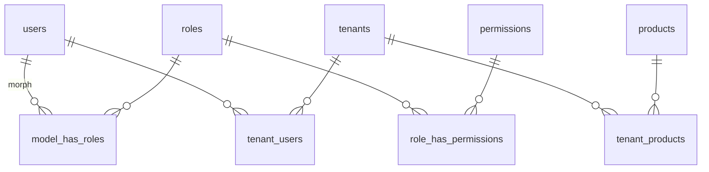

# AmazePays B2B Multi-Tenancy Architecture

> **Version:** 2.0  
> **Last Updated:** April 2026

---

## Table of Contents

1. [Overview](#1-overview)
2. [Tenant Model](#2-tenant-model)
3. [Role-Based Access Control](#3-role-based-access-control)
4. [Tenant Scoping](#4-tenant-scoping)
5. [B2B Client Onboarding](#5-b2b-client-onboarding)
6. [B2B Client Portal](#6-b2b-client-portal)
7. [Product Assignment & Pricing](#7-product-assignment--pricing)
8. [B2C Admin CRUD Operations](#8-b2c-admin-crud-operations)
9. [Offers & Promotions Management](#9-offers--promotions-management)
10. [Tenant Suspension & Deactivation](#10-tenant-suspension--deactivation)
11. [Implementation Details](#11-implementation-details)

---

## 1. Overview

AmazePays uses a **single-database, tenant-scoped** multi-tenancy model. All B2B clients (tenants) share the same MySQL database, but data isolation is enforced via:

- **`tenant_id`** column on all tenant-aware tables
- **Global Eloquent scope** that auto-filters queries by the authenticated user's tenant
- **Middleware** that resolves the current tenant on every request
- **Policy-based authorization** that enforces access boundaries

### Tenant Types

| Type | Description | Panel Access |
|------|-------------|-------------|
| Platform (Super Admin) | AmazePays itself | Full admin panel |
| B2B Client | Business distributor/reseller | B2B portal + API |
| B2C Consumer | End consumer | Storefront + mobile app |

B2C consumers do **not** have a tenant. Their `tenant_id` is `NULL` on orders and wallets.

---

## 2. Tenant Model

### `tenants` table and related pivots

Authoritative model: [`app/Models/Tenant.php`](../app/Models/Tenant.php). Migration: [`database/migrations/2026_04_14_000003_create_tenants_table.php`](../database/migrations/2026_04_14_000003_create_tenants_table.php).

| Artifact | Purpose |
|----------|---------|
| **`tenants`** | B2B organization: `name`, `slug`, `type`, `status`, `margin_percentage`, `credit_limit`, `settings` (JSON), contact fields, suspension metadata, etc. |
| **`tenant_users`** | Links **`users`** to **`tenants`**. Pivot columns: `role` (org role enum), `is_primary`, timestamps. Unique `(tenant_id, user_id)`. |
| **`tenant_products`** | Which **`products`** rows a tenant may sell; pivot: `custom_price`, `margin_override`, `is_active`. |

### `tenant_users` pivot (org role, not Spatie)

| Column | Description |
|--------|-------------|
| `tenant_id` | FK → `tenants.id` |
| `user_id` | FK → `users.id` |
| `role` | **`owner`**, **`manager`**, **`operator`**, or **`viewer`** (DB enum). This is the user’s **job title inside that company**. It is **not** the same as a Spatie role name (`b2b-client`, etc.). |
| `is_primary` | If `true`, this tenant is chosen first by [`ResolveTenant`](../app/Http/Middleware/ResolveTenant.php) when the user has multiple tenant links. |

Eloquent:

- `Tenant::users()` — `belongsToMany(User::class, 'tenant_users')->withPivot('role', 'is_primary')`.
- `User::tenants()` — inverse on [`app/Models/User.php`](../app/Models/User.php).

### Tenant settings JSON (illustrative)

```json
{
  "allowed_payment_methods": ["wallet", "ccavenue", "razorpay"],
  "order_approval_required": false,
  "max_order_amount": 500000,
  "min_order_amount": 100,
  "notification_emails": ["finance@client.com", "ops@client.com"],
  "webhook_url": "https://client.com/webhooks/amazepays",
  "auto_fulfill": true,
  "invoice_prefix": "CLI",
  "timezone": "Asia/Kolkata"
}
```

---

## 3. Role-Based Access Control

### Spatie vs `tenant_users.role` (two different concepts)

| Concept | Storage | Meaning |
|---------|---------|--------|
| **Panel / app RBAC (Spatie)** | `roles`, `permissions`, `model_has_roles`, `role_has_permissions` | Gates **`/panel`** features via permission strings (e.g. `b2b.shop.view`, `tenants.view`). Assigned on **`User`** through `HasRoles` in [`app/Models/User.php`](../app/Models/User.php). |
| **Tenant membership (org role)** | `tenant_users.role` | **Per-tenant** job: `owner`, `manager`, `operator`, `viewer`. **Does not** grant Spatie permissions. Used for org semantics; assortment and B2B shop data still depend on **`tenant_products`** and `current_tenant`. |

A B2B portal user normally has **both**: a Spatie role such as **`b2b-client`** or **`b2b-operator`**, **and** at least one **`tenant_users`** row (set **`is_primary`** when the user belongs to multiple tenants).



**`current_tenant` resolution** ([`ResolveTenant`](../app/Http/Middleware/ResolveTenant.php)): (1) logged-in user’s **`is_primary`** tenant link, else first linked tenant; (2) else header **`X-Tenant-Slug`**; (3) else bearer **API key** → that key’s tenant.

### Spatie roles (authoritative)

Defined and granted in [`database/seeders/RolesAndPermissionsSeeder.php`](../database/seeders/RolesAndPermissionsSeeder.php):

| Role | Notes |
|------|--------|
| `super-admin` | Receives all permissions. |
| `admin` | Broad panel access; exact list is in the seeder (includes catalog, tenants, settings, etc.). |
| `finance` | Orders, wallets, load requests, reports. |
| `b2b-client` | Full B2B portal feature set in seeder (shop, orders, team, API keys, wallet loads, finance tab, reports). |
| `b2b-operator` | Narrower B2B (orders, shop, price list, wallet view). |
| `b2c-user` | Created with **no** permissions by default (storefront customer). |
| `reseller` | `b2b.place_order`, `b2b.view_orders` only. |

There are **no** seeded roles named `b2b-manager` or `b2c-manager` (older doc names).

### Permissions (naming)

- Use the **exact** strings from the seeder: e.g. **`products.update`** (not `products.edit`), **`api_keys.view`** (not `api-keys.view`), **`audit_logs.view`** (not `audit.view`), **`settings.update`** (not `settings.edit`).
- Product admin catalog sections: **`products.catalog.storefront`**, **`products.catalog.business`**, **`products.catalog.all`** (plus **`products.view`** for panel product area). See [VOUCHER_PROVIDERS.md](./VOUCHER_PROVIDERS.md) and admin product controller.
- Full permission list: see the `$permissions` array in `RolesAndPermissionsSeeder`.

### B2B Spatie permissions (excerpt)

| Permission | `b2b-client` | `b2b-operator` | `reseller` |
|------------|:------------:|:--------------:|:----------:|
| `b2b.shop.view` | Yes | Yes | Yes |
| `b2b.price_list.view` | Yes | Yes | Yes |
| `b2b.place_order` | Yes | Yes | Yes |
| `b2b.view_orders` | Yes | Yes | Yes |
| `b2b.finance.view` | Yes | No | No |
| `b2b.manage_team` | Yes | No | No |
| `b2b.manage_api_keys` | Yes | No | No |
| `b2b.wallet.load` | Yes | No | No |
| `reports.view` | Yes | No | No |
| `products.view` | No | No | No |

B2B catalog visibility in the shop is driven by **`tenant_products`** and catalog services (e.g. `B2bCatalogService`), **not** by the pivot `tenant_users.role`.

---

## 4. Tenant Scoping

### Global Scope

```php
// app/Scopes/TenantScope.php

namespace App\Scopes;

use Illuminate\Database\Eloquent\Builder;
use Illuminate\Database\Eloquent\Model;
use Illuminate\Database\Eloquent\Scope;

class TenantScope implements Scope
{
    public function apply(Builder $builder, Model $model): void
    {
        $user = auth()->user();

        if (!$user) return;

        // Super admins and platform admins see everything
        if ($user->hasRole(['super-admin', 'admin', 'finance'])) return;

        $tenantId = $user->currentTenantId();

        if ($tenantId) {
            $builder->where($model->getTable() . '.tenant_id', $tenantId);
        } else {
            // B2C user: only see own data (no tenant scope, use user_id)
            if ($model->getTable() !== 'products') {
                $builder->where($model->getTable() . '.user_id', $user->id);
            }
        }
    }
}
```

### Tenant Trait

```php
// app/Traits/BelongsToTenant.php

namespace App\Traits;

use App\Scopes\TenantScope;

trait BelongsToTenant
{
    protected static function bootBelongsToTenant(): void
    {
        static::addGlobalScope(new TenantScope());

        // Auto-set tenant_id on creation
        static::creating(function ($model) {
            if (auth()->check() && !$model->tenant_id) {
                $model->tenant_id = auth()->user()->currentTenantId();
            }
        });
    }

    public function tenant()
    {
        return $this->belongsTo(\App\Models\Tenant::class);
    }
}
```

### Models Using Tenant Scope

```php
// Apply to tenant-aware models:
class Order extends Model
{
    use BelongsToTenant;
    // ...
}

// Also apply to: WalletLoadRequest, AuditLog, ApiKey
// Do NOT apply to: User, Product, ProductCategory, Brand (global models)
```

### Middleware

```php
// app/Http/Middleware/ResolveTenant.php

class ResolveTenant
{
    public function handle(Request $request, Closure $next)
    {
        if ($request->user()) {
            $tenant = $request->user()->currentTenant();

            if ($tenant && $tenant->isSuspended()) {
                abort(403, 'Your organization account is suspended. Contact support.');
            }

            app()->instance('currentTenant', $tenant);
        }

        return $next($request);
    }
}
```

---

## 5. B2B Client Onboarding

### Onboarding Flow

```
Admin creates tenant
    │
    ▼
Fill organization details:
  - Company name, GST, address
  - Contact person, email, phone
  - Default margin percentage
  - Credit limit
    │
    ▼
Create owner user:
  - Email, name, mobile
  - Auto-generate temporary password
  - Send invitation email
    │
    ▼
Assign products:
  - Select from global catalog
  - Set custom pricing (optional)
  - Set per-product margin overrides (optional)
    │
    ▼
Configure payment methods:
  - Enable wallet payments
  - Add gateway credentials (optional)
    │
    ▼
Configure voucher providers:
  - Use platform defaults, OR
  - Add tenant-specific provider credentials
    │
    ▼
Activate tenant (status = active)
    │
    ▼
B2B client logs in and starts ordering
```

### Admin UI (Inertia + React)

```
Tenant Onboarding Form (multi-step wizard):

Step 1: Organization Details
┌──────────────────────────────────────┐
│ Company Name: [__________________]   │
│ GST Number:   [__________________]   │
│ Website:      [__________________]   │
│ Address:      [__________________]   │
│ City:         [________] State: [__] │
│ Pincode:      [______]               │
│ Contact Email:[__________________]   │
│ Contact Phone:[__________________]   │
│ [Next →]                             │
└──────────────────────────────────────┘

Step 2: Financial Settings
┌──────────────────────────────────────┐
│ Margin %:     [5.00]                 │
│ Credit Limit: [₹ 100,000.00]        │
│ Payment Methods:                     │
│   [x] Wallet                         │
│   [ ] CCAvenue                       │
│   [ ] Razorpay                       │
│   [ ] Unlimit                        │
│ [← Back] [Next →]                    │
└──────────────────────────────────────┘

Step 3: Product Assignment
┌──────────────────────────────────────┐
│ Search: [____________] [Filter ▼]    │
│                                      │
│ [x] Amazon Gift Card    ₹487.50     │
│ [x] Flipkart Gift Card  ₹490.00    │
│ [ ] Swiggy Gift Card    ₹475.00    │
│ [x] Myntra Gift Card    ₹480.00    │
│                                      │
│ Selected: 3 products                 │
│ [← Back] [Next →]                    │
└──────────────────────────────────────┘

Step 4: Owner Account
┌──────────────────────────────────────┐
│ Owner Name:  [__________________]    │
│ Owner Email: [__________________]    │
│ Owner Phone: [__________________]    │
│                                      │
│ [← Back] [Create Tenant]            │
└──────────────────────────────────────┘
```

---

## 6. B2B Client Portal

### Portal Sections

| Section | Features |
|---------|----------|
| Dashboard | Wallet balance, orders today/month, top products, recent transactions |
| Place Order | Browse assigned products, add to cart, select payment method, submit |
| Bulk Order | Upload CSV (SKU, qty, denomination), validate, submit |
| Order History | Search/filter orders, view details, download voucher codes, export |
| Wallet | Balance, transaction history, request load (UTR + proof upload) |
| Team | Invite operators, manage sub-users, toggle active status |
| Reports | Date-range reports: orders, spend, product breakdown |
| API Keys | View/create API keys (if reseller role enabled) |
| Settings | Company profile, notification preferences, webhook URL |

### B2B Order Flow

```
B2B Client Portal
    │
    ▼
Browse assigned products (tenant_products filter)
    │
    ▼
Select product + denomination + quantity
    │
    ▼
Choose payment method:
  ├── Wallet → Check balance → Debit → Place order
  └── Gateway → Redirect to payment → On success → Place order
    │
    ▼
Order queued for async fulfillment
    │
    ▼
Voucher codes delivered via:
  - Portal (view in order details)
  - Email to configured address
  - Webhook to client system (if configured)
```

---

## 7. Product Assignment & Pricing

### Pricing Model

```
Final B2B price = Base price - (Base price × margin_percentage / 100)

Where margin_percentage can be:
1. tenant_products.margin_override (per-product, if set)
2. tenants.margin_percentage (tenant default, if no override)
3. 0% (no discount -- same as B2C price)
```

**Example:**

| Product | Base Price | Tenant Margin (5%) | Product Override (8%) | Final Price |
|---------|-----------|--------------------|-----------------------|-------------|
| Amazon ₹500 | ₹500 | ₹475 | -- | ₹475 |
| Flipkart ₹1000 | ₹1000 | ₹950 | ₹920 (8%) | ₹920 |

### Product Assignment Rules

- Only assigned products visible to B2B client
- Admin can bulk-assign (all products, by category, by brand)
- Products can be deactivated per-tenant without global impact
- Custom descriptions/images per-tenant (planned, stored in `tenant_products.settings`)

---

## 8. B2C Admin CRUD Operations

### Product Management

The B2C admin panel provides full CRUD for managing the consumer storefront:

**Product CRUD:**

| Operation | Endpoint (Inertia) | Description |
|-----------|-------------------|-------------|
| List | `GET /admin/products` | Paginated list with search, filters (category, brand, stock, visibility) |
| Create | `GET /admin/products/create` | Form to manually add a product |
| Store | `POST /admin/products` | Validate and save new product |
| Edit | `GET /admin/products/{id}/edit` | Edit form pre-filled with product data |
| Update | `PUT /admin/products/{id}` | Validate and update product |
| Delete | `DELETE /admin/products/{id}` | Soft delete (set `show_product = false`) |
| Toggle Visibility | `PATCH /admin/products/{id}/toggle` | Quick show/hide toggle |
| Bulk Sync | `POST /admin/products/sync` | Trigger provider catalog sync |

**Product Form Fields (Admin):**

```
┌──────────────────────────────────────────┐
│ Product Edit                              │
│                                          │
│ Name: [_________________________]         │
│ SKU:  [_________________________] (RO*)   │
│ Source: [Woohoo ▼]              (RO*)     │
│                                          │
│ Custom Description:                       │
│ [                                    ]    │
│ [          Rich text editor          ]    │
│ [                                    ]    │
│                                          │
│ How to Redeem:                           │
│ [                                    ]    │
│                                          │
│ Terms & Conditions:                       │
│ [                                    ]    │
│                                          │
│ Category: [Shopping ▼]                    │
│ Brand:    [Amazon ▼]                      │
│                                          │
│ Images:                                  │
│ [Upload custom image] or use provider    │
│                                          │
│ Pricing:                                 │
│ Discount %: [2.50]                       │
│ CGST: [0.00] SGST: [0.00] IGST: [0.00] │
│                                          │
│ Display:                                 │
│ Priority: [5] Secondary Priority: [0]    │
│ [x] Show on storefront                   │
│ [ ] Special SKU                          │
│ [ ] Out of stock                         │
│                                          │
│ *RO = Read-Only for synced products      │
│                                          │
│ [Cancel] [Save Product]                  │
└──────────────────────────────────────────┘
```

### Category Management

| Operation | Description |
|-----------|-------------|
| List | Tree view of categories with drag-drop ordering |
| Create | Name, slug (auto-generated), parent category, thumbnail |
| Edit | Update name, slug, thumbnail, parent |
| Delete | Only if no products assigned (or reassign first) |
| Reorder | Drag-and-drop priority ordering |

### Brand Management

| Operation | Description |
|-----------|-------------|
| List | Grid view with logos |
| Create | Name, slug, logo upload |
| Edit | Update name, logo |
| Delete | Only if no products assigned |

### Homepage / CMS Management

| Operation | Description |
|-----------|-------------|
| Hero carousel | **Settings → Hero carousel** (`/panel/settings/hero-slides`): CRUD for storefront hero slides (`desktop_image`, `image_mobile`, links to product/category/brand or custom URL). Uses `settings.view` / `settings.update`. |
| Homepage Sections | **Settings → Homepage sections**: toggle blocks on/off and order; the **banner** row controls whether the hero *area* is shown on the web home (images are edited in Hero carousel). |
| Featured Products | Select products to feature on homepage |

---

## 9. Offers & Promotions Management

### Offer CRUD

Full admin CRUD for creating and managing promotional offers on voucher cards:

**List View:**

```
┌──────────────────────────────────────────────────────────────┐
│ Offers & Promotions                        [+ Create Offer]  │
│                                                              │
│ Filter: [All ▼] [Active ▼] [Date range: _____ to _____]    │
│                                                              │
│ ┌──────────────────────────────────────────────────────────┐ │
│ │ Name              │ Type     │ Value │ Usage │ Status    │ │
│ ├───────────────────┼──────────┼───────┼───────┼──────────┤ │
│ │ Summer Sale 2026  │ % Off    │ 10%   │ 45/100│ Active   │ │
│ │ First Order Bonus │ Flat Off │ ₹100  │ 23/∞  │ Active   │ │
│ │ Diwali Cashback   │ Cashback │ 15%   │ 0/500 │ Scheduled│ │
│ │ Buy 2 Get 1       │ Bundle   │ 1 free│ 12/50 │ Expired  │ │
│ └──────────────────────────────────────────────────────────┘ │
└──────────────────────────────────────────────────────────────┘
```

**Create / Edit Form:**

```
┌──────────────────────────────────────────┐
│ Create Offer                              │
│                                          │
│ Name: [_________________________]         │
│ Description: [__________________]         │
│                                          │
│ Type: [Percentage Discount ▼]             │
│   Options: Percentage Discount            │
│            Flat Discount                  │
│            Cashback to Wallet             │
│            Buy X Get Y                    │
│            First Order Discount           │
│                                          │
│ Value: [10] %                            │
│ Max Discount Cap: [₹ 500]               │
│ Min Order Amount: [₹ 200]               │
│                                          │
│ Usage Limits:                            │
│ Total uses: [100] (blank = unlimited)    │
│ Per user:   [1]                          │
│                                          │
│ Applicable To:                           │
│ Products:   [Select products...]         │
│ Categories: [Select categories...]       │
│ Brands:     [Select brands...]           │
│ (Leave all blank = applies to everything)│
│                                          │
│ Schedule:                                │
│ Start: [2026-04-07] End: [2026-05-07]   │
│                                          │
│ Promo Code: [SUMMER10] (optional)        │
│ [x] Auto-apply (no code needed)          │
│                                          │
│ Scope:                                   │
│ ( ) Platform-wide (all customers)        │
│ ( ) Specific tenant: [Select ▼]          │
│                                          │
│ Banner Image: [Upload]                   │
│                                          │
│ [Cancel] [Save Offer]                    │
└──────────────────────────────────────────┘
```

### Offer Validation Rules

- `start_date` must be before `end_date`
- `value` must be positive
- `max_discount` required when type is `percentage_discount`
- `promo_code` must be unique (if provided)
- Cannot edit `type` after offer has been used
- Cannot reduce `max_uses_total` below `current_uses`

---

## 10. Tenant Suspension & Deactivation

### Suspension Triggers

| Trigger | Action | Reversible |
|---------|--------|-----------|
| Manual (admin) | Admin suspends via UI | Yes |
| Credit limit exceeded | Auto-suspend when wallet is negative beyond limit | Yes (on reload) |
| Overdue payment | After 30 days of unpaid invoices | Yes (on payment) |
| Security concern | Suspicious activity detected | Yes (after review) |
| Contract expiry | Contract end date reached | Yes (on renewal) |

### Suspension Effects

- B2B portal shows "Account suspended" message
- API keys return `403 Forbidden`
- Existing orders continue processing (no mid-order cancellation)
- New orders blocked
- Wallet load requests blocked
- Data preserved (not deleted)

### Deactivation (Permanent)

- Admin sets status to `inactive`
- All API keys revoked
- User accounts unlinked from tenant
- Data retained for compliance (configurable retention period)
- Credentials wiped from `tenant_payment_gateways` and `tenant_voucher_providers`

---

## 11. Implementation Details

### User model (`tenant_users` pivot)

The live implementation is in [`app/Models/User.php`](../app/Models/User.php) (Spatie `HasRoles` is separate). Membership uses **`is_primary`**, not `is_active`, on the pivot:

```php
public function tenants(): BelongsToMany
{
    return $this->belongsToMany(Tenant::class, 'tenant_users')
        ->withPivot('role', 'is_primary')
        ->withTimestamps();
}

public function currentTenant(): ?Tenant
{
    $primary = $this->tenants()->wherePivot('is_primary', true)->first();

    return $primary ?? $this->tenants()->first();
}

public function currentTenantId(): ?int
{
    return $this->currentTenant()?->id;
}
```

To test membership for a given tenant id: `$user->tenants()->where('tenants.id', $tenantId)->exists()`.

HTTP requests use [`app/Http/Middleware/ResolveTenant.php`](../app/Http/Middleware/ResolveTenant.php) (middleware alias **`tenant`**) to set `app('current_tenant')`; resolution order matches §3 (primary pivot → first link → `X-Tenant-Slug` → bearer API key).

### Route groups (panel + B2B)

The admin UI and B2B shop live under **`/panel`**, not a legacy `/admin` prefix. See [`routes/admin.php`](../routes/admin.php):

- **Panel shell:** `Route::prefix('panel')->middleware(['auth', 'two.factor'])` — individual routes add `permission:…` (Spatie), not a single `role:` gate on the whole group.
- **B2B (tenant-scoped):** `Route::prefix('panel/b2b')->middleware('tenant')` — each route uses the relevant `permission:b2b.*` (e.g. `b2b.shop.view`, `b2b.place_order`).

B2B users typically have Spatie roles **`b2b-client`** or **`b2b-operator`** (see [`database/seeders/RolesAndPermissionsSeeder.php`](../database/seeders/RolesAndPermissionsSeeder.php)) **and** a row in **`tenant_users`** with org role `owner|manager|operator|viewer`.

---

## Related Documents

- [ADMIN_PANEL.md](ADMIN_PANEL.md) -- Admin panel modules and Voyager migration
- [CODE_STANDARDS.md](CODE_STANDARDS.md) -- Validated input, webhook whitelisting, logging rules
- [WALLET_SYSTEM.md](WALLET_SYSTEM.md) -- Wallet load flow details
- [DATABASE_DICTIONARY.md](DATABASE_DICTIONARY.md) -- Tenant table schemas
- [SECURITY.md](SECURITY.md) -- RBAC and authorization details
- [API_DOCUMENTATION.md](API_DOCUMENTATION.md) -- Reseller API (tenant-scoped)
