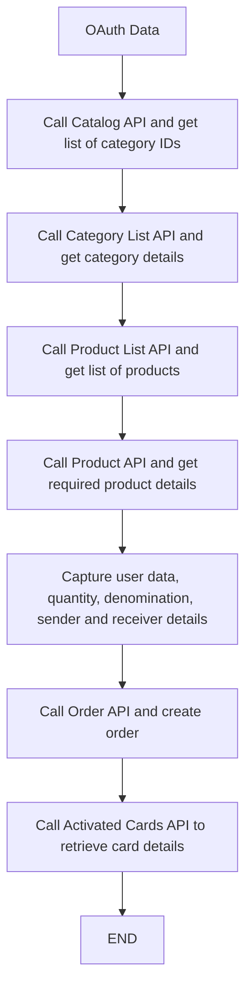

# REST API V3 (RECOMMENDED)

Future-ready integration reference for Woohoo V3 APIs.

## Table of Contents
- [Introduction](#introduction)
- [Sandbox Credentials and Onboarding Notes](#sandbox-credentials-and-onboarding-notes)
- [V3 Flow](#v3-flow)
- [Detailed Steps](#detailed-steps)
- [Category API](#category-api)
- [Category API - Do's and Don'ts](#category-api---dos-and-donts)
- [Product List API](#product-list-api)
- [Product API](#product-api)
- [Related Products API](#related-products-api)
- [Beneficiary Validation API](#beneficiary-validation-api)
- [Order API (Create)](#order-api-create)
- [Order Details API](#order-details-api)
- [Order List API](#order-list-api)
- [Order Status API](#order-status-api)
- [Activated Cards API](#activated-cards-api)
- [Balance API](#balance-api)
- [Order Resend API](#order-resend-api)
- [Order Reversal API](#order-reversal-api)
- [Orders Validate API](#orders-validate-api)
- [Themes Category API](#themes-category-api)
- [Transaction History API](#transaction-history-api)

## Introduction

Post authorization and receipt of access token & access token secret, any of the QwikGift APIs can be invoked.  
Refer to the APIs supported in V2 and V3 sections for API availability details.

For every API call:
- Set request headers.
- Set authorization headers.

Catalog and discovery flow:
- Make a GET request to Catalog API to get list of categories configured for the account.
- Make a GET request to Category List API to get category details.
- Make a GET request to Product List API to get list of products enabled in the category.
- Make a GET request to Product API to get details of required products.

Data handling guidance:
- Category and product response data should be stored in local database.
- Category and Product APIs must NOT be called frequently.

## Sandbox Credentials and Onboarding Notes

Source: onboarding email from Rajiv Singh (`rajiv.singh@qwikcilver.com`) dated Dec 9, 2022 for Frenetic India (Amazepays) sandbox setup.

### Sandbox Login / OAuth
- Sandbox login username: configured via environment variables.
- Sandbox login password: configured via environment variables.
- OAuth consumer key (`WOOHOO_CLIENT_ID`): configured via environment variables.
- OAuth consumer secret (`WOOHOO_CLIENT_SECRET`): configured via environment variables.

Security note:
- Do not store or share live/sandbox secrets in documentation, screenshots, tickets, or source-controlled markdown files.
- Keep credentials only in secure secret storage / environment files with restricted access.
- If credentials are accidentally exposed, rotate immediately and audit recent usage.

### Reference Links
- Portal: `https://developers.woohoo.in/`
- OAuth authentication steps: `https://developers.woohoo.in/docs/get-started-title/oauth-2-0-protocol-recommended/oauth2-0-authentication-steps/`
- OAuth signature generation steps: `https://developers.woohoo.in/docs/get-started-title/oauth-2-0-protocol-recommended/oauth2-0-signature-generation-steps-for-request/`
- Signature generation FAQs: `https://developers.woohoo.in/docs/get-started-title/oauth-2-0-protocol-recommended/signature-generation-faqs/`

### Initial Integration Calls (Sandbox)
- Categories: `https://sandbox.woohoo.in/rest/v3/catalog/categories/121`
- Category products: `https://sandbox.woohoo.in/rest/v3/catalog/categories/121/products`

### Operational Notes
- Product ids and SKUs differ between sandbox and production; do not assume parity.
- Product images are returned in API responses and can be resized in client UI.
- Use unique alphanumeric PO number (max 50 chars). Allowed special chars: `_ . ( ) /`.
- Use quantity `1` and specific denomination for initial testing scenarios.
- On successful order placement, Woohoo returns gift card details (card number/PIN) and Woohoo order number.
- Complete SIT test kit and test-case sheet after integration.

## Fraud Prevention and Validation Policy

This project enforces strict request validation to prevent tampering, hidden-field injection, and client-side amount manipulation.

### Mandatory Security Controls
- Backend is the single source of truth for denomination, quantity, discount, tax, and payable amount.
- Any unknown/unexpected payload fields must be rejected (`422`) instead of silently ignored.
- Hidden form fields must never be trusted for sensitive values (amount/order ownership/provider refs).
- Payment callback/webhook signatures must be verified before processing.
- Callback amount mismatch must hard-fail fulfillment and move the order to failed/review state.
- Route-level authorization and ownership checks are required before every payment/order mutation.

### Validation Rules (Frontend + Backend)
- Frontend validation is UX guidance only; backend validation is mandatory and authoritative.
- Do not pass internal-only fields from client (for example raw discount amount, server order status, provider internal flags).
- Only explicitly allowlisted fields can be accepted at checkout, order, billing, and gift-form endpoints.

### Provider-Aware Billing Requirement Matrix
- `UPI + Woohoo`: `billing_name`, `billing_email`, `billing_address`, `billing_city`, `billing_state`, `billing_zip`, `billing_country`
- `CCAvenue`: `billing_name`, `billing_email`, `billing_tel`, `billing_address`, `billing_address_two`, `billing_city`, `billing_state`, `billing_zip`, `billing_country`
- `Wallet/Internal`: `billing_name`, `billing_email`

Why this exists:
- Woohoo order payload uses shipping/billing address fields for fulfillment and reconciliation.
- Different payment providers have different billing payload requirements.
- UI warnings should reflect server-side provider requirement resolution, not a single global hardcoded list.

### Checkout Summary Security Notes
- Checkout summary should display product context and final payable only.
- Do not treat client-side denomination/quantity/totals as authority values at payment time.
- Server resolves payable from persisted order state and validates ownership before payment initiation.
- Unexpected or hidden payload fields are rejected to prevent tampering.

### Logging and Data Protection
- Never log full callback headers/bodies containing sensitive/payment data.
- Mask or omit signatures, tokens, card data, and secrets in logs.
- Store only required fields for audit and troubleshooting.

## V3 Flow

High-level flow from OAuth to card activation:



Logical phases:
- Product discovery: Catalog -> Category -> Product List -> Product details
- Order creation: capture mandatory details -> create order
- Fulfillment: retrieve activated cards and complete

## Detailed Steps

To place an order in Woohoo server, perform the following:

1. Capture all mandatory user data as per Order API details.
2. Make a POST request to Order API with all mandatory parameters:
   - Pass valid sender and receiver details
   - Pass unique reference number
   - Pass all required Order API parameters
3. Based on Sync mode:
   - If Sync Only is `True`:
     - API generates cards and returns card data based on delivery mode.
     - Data must be encrypted and stored in database.
     - Card details must be passed to end customer from database.
   - If Sync Only is `False`:
     - API creates order and returns order id.
     - Use order id to retrieve card data based on delivery mode.
     - Data must be encrypted and stored in database.
     - Card details must be passed to end customer from database.
4. Make GET request to Activated Cards API to retrieve card data for the full quantity.
5. During order fulfillment, if response is not received within desired timeout:
   - Call Order Status API.
   - If status is `complete`, call Activated Cards API for card details.
   - If status is not `complete`, order must be cancelled.

## Category API

### Description
This API is used to receive details of categories enabled for your account.

Category ID must be available for calling this API when specific category detail is needed.
- If specific category needs to be retrieved, provide category id.
- Otherwise, category id can be optional.

Category API may be called periodically.

### Method
`GET`

### URL/Path
`baseurl/rest/v3/catalog/categories/{id}`

Example:
- `sandbox.woohoo.in/rest/v3/catalog/categories/id`

### Request Headers
| Header | Value |
|---|---|
| Content-Type | application/json |
| Accept | */* |

### Request URL Parameters
| Field Name | Data Type | Mandatory/Optional | Description | Example |
|---|---|---|---|---|
| id | int | Optional | Category ID | 5 |

Sample Request:
- For GET calls, request body is not required.
- For GET calls, request parameters are not required.

### Sample Response (200)

```json
{
  "id": "7",
  "name": "Woohoo Root",
  "url": "/woohoo-root",
  "description": null,
  "images": {
    "image": null,
    "thumbnail": null
  },
  "subcategoriesCount": 15,
  "subcategories": [
    {
      "id": "8",
      "name": "Brands",
      "url": "brands",
      "description": null,
      "colorCode": "#34282C",
      "offerDescription": "UPTO<b> 5% </b> OFF",
      "images": {
        "image": null,
        "thumbnail": null
      },
      "subcategoriesCount": 21
    },
    {
      "id": "10",
      "name": "By Category",
      "url": "by-category",
      "description": "By Category",
      "colorCode": "#34282C",
      "offerDescription": "UPTO<b> 5% </b> OFF",
      "images": {
        "image": null,
        "thumbnail": null
      },
      "subcategoriesCount": 8
    }
  ]
}
```

### Sample Response (400)

```json
{
  "code": 6652,
  "message": "Invalid Category",
  "messages": []
}
```

### Response Parameters

#### 1) Success
| Field Name | Data Type | Mandatory | Description | Example |
|---|---|---|---|---|
| id | string | No | Catalog ID. If `/{id}` is not passed then complete category list is provided. | `catalog/categories/10`, `catalog/categories` |
| name | string | Yes | Catalog Name | WOOHOO |
| url | string | Yes | Catalog URL | woohoo |
| description | string | No | Catalog Description | About Category |
| images | object | No | Image object | - |
| images.image | string | No | Catalog image URL | Image URL |
| images.thumbnail | string | No | Catalog thumbnail URL | Image URL |
| subcategoriesCount | number | No | Sub category count | 3 |
| subcategories | array | No | Sub category array | - |
| subcategories.id | string | No | Sub category ID | 12 |
| subcategories.name | string | No | Sub category name | Digital Cards |
| subcategories.url | string | No | Sub category URL | digital |
| subcategories.description | string | No | Sub category description | About Category |
| subcategories.colorCode | string | No | Color applied to text on image | #34282C |
| subcategories.offerDescription | string | No | Offer description (HTML format) | UPTO 5% OFF |
| subcategories.images.image | string | No | Sub category image URL | Image URL |
| subcategories.images.thumbnail | string | No | Sub category thumbnail URL | Image URL |
| subcategories.subcategoriesCount | string | No | Nested sub category count | 0 |

#### 2) Failure
| Field Name | Data Type | Mandatory | Description | Example |
|---|---|---|---|---|
| code | number | Yes | Error code | 6652 |
| message | string | Yes | Error message | Invalid Category |
| messages | array | No | Additional messages | [] |

### HTTP Codes
| Status Code | Message | Description |
|---|---|---|
| 200 | Ok | Category details returned |
| 400 | Bad Request | Request validations failed |
| 401 | Unauthorized | OAuth authorization failed |
| 403 | Forbidden | API access revoked or insufficient permissions |
| 500 | Internal Server Error | Error occurred on Woohoo |

### Error Response Codes
| Status Code | Description |
|---|---|
| 6652 | Invalid category |

## Category API - Do's and Don'ts

### Do's
- Category List API must be called periodically i.e. once a month.
- The data must be stored in local DB and when Gift Category is clicked on UI, data must be retrieved from local DB and no calls are made to Woohoo servers.

### Don'ts
- Category List API must not be called very frequently as it will create unnecessary load on Woohoo server.

---

## Product List API
### Description
This API is used to retrieve the category product list. Category ID details must be available for calling this API.

Product List API should be called periodically (recommended: once a month).
If there are changes in product attributes, QC will inform the integrator about the impact.
Post confirmation from QC, call Product List API and refresh local database.

### Method
`GET`

### URL/Path
`baseurl/rest/v3/catalog/categories/{id}/products?offset={offset}&limit={limit}`

Example:
- `sandbox.woohoo.in/rest/v3/catalog/categories/id/products?offset=offset&limit=limit`

### Request URL Parameters
| Field Name | Data Type | Mandatory/Optional | Description | Example |
|---|---|---|---|---|
| id | int | Optional | Category ID | 5 |
| offset | int | Optional | Position from where product list is retrieved | If limit is 10 and offset is 0, products [0-9] are returned. If offset is 5, products [5-14] are returned. |
| limit | int | Optional | Number of products per page. Max value is `500` | 100 |

### Request Headers
| Header | Value |
|---|---|
| Content-Type | application/json |
| Accept | */* |

Sample Request:
- For GET calls, request body is not required.
- For GET calls, request parameters are not required.

### Sample Response (200)

```json
{
  "id": "7",
  "name": "Woohoo Root",
  "url": "/woohoo-root",
  "description": null,
  "images": {
    "image": null,
    "thumbnail": null
  },
  "productsCount": 40,
  "products": [
    {
      "sku": "EGCGBPAN001",
      "name": "Pantaloons E-Gift Card",
      "currency": {
        "code": "INR",
        "symbol": "₹",
        "numericCode": "356"
      },
      "url": "pantaloons-e-gift-card",
      "offerShortDesc": "test short desc",
      "relatedProductOptions": {
        "PROMO": true,
        "DESIGNS": false,
        "Games": false
      },
      "minPrice": "100",
      "maxPrice": "2000",
      "images": {
        "thumbnail": "https://gbdev.s3.amazonaws.com/uat/product/EGCGBPAN001/d/thumbnail/233_woohoo.png",
        "mobile": "https://gbdev.s3.amazonaws.com/uat/product/EGCGBPAN001/d/mobile/233_woohoo.png",
        "base": "https://gbdev.s3.amazonaws.com/uat/product/EGCGBPAN001/d/image/233_woohoo.png",
        "small": "https://gbdev.s3.amazonaws.com/uat/product/EGCGBPAN001/d/small_image/233_woohoo.png"
      },
      "createdAt": "",
      "updatedAt": "",
      "campaigns": null,
      "corporateDiscounts": {
        "discount": [
          {
            "endDate": "2025-01-24T18:29:00",
            "slabs": [
              {
                "amount": 0,
                "maxAmount": 200,
                "minAmount": 1
              },
              {
                "amount": 0,
                "maxAmount": 300,
                "minAmount": 200.01
              }
            ],
            "startDate": "2025-01-23T06:30:00",
            "type": "slab"
          }
        ],
        "sku": "fegc"
      }
    },
    {
      "sku": "GCGBAMZN001",
      "name": "Amazon.in Gift Card",
      "currency": {
        "code": "INR",
        "symbol": "₹",
        "numericCode": "356"
      },
      "url": "amazon-in-gift-card",
      "minPrice": "1",
      "maxPrice": "10000",
      "images": {
        "thumbnail": "https://gbdev.s3.amazonaws.com/uat/product/GCGBAMZN001/d/thumbnail/137_woohoo.png",
        "mobile": "https://gbdev.s3.amazonaws.com/uat/product/GCGBAMZN001/d/mobile/137_woohoo.jpg",
        "base": "https://gbdev.s3.amazonaws.com/uat/product/GCGBAMZN001/d/image/137_woohoo.jpg",
        "small": "https://gbdev.s3.amazonaws.com/uat/product/GCGBAMZN001/d/small_image/137_woohoo.png"
      }
    }
  ]
}
```

Fixed corporate discount example node:

```json
{
  "corporateDiscounts": {
    "discount": [
      {
        "amount": 5,
        "endDate": null,
        "startDate": "2025-01-31T11:42:00",
        "type": "fixed"
      }
    ]
  }
}
```

### Sample Response (400)

```json
{
  "code": 6652,
  "message": "Invalid Category",
  "messages": []
}
```

### Response Parameters

#### Success
| Field Name | Data Type | Mandatory | Description | Example |
|---|---|---|---|---|
| id | string | Yes | Catalog ID | 2 |
| name | string | Yes | Catalog Name | Digital |
| url | string | Yes | Catalog URL | digital |
| description | string | No | Catalog Description | About Catalog |
| offerShortDesc | string | No | Brief description of the product | - |
| relatedProductOptions | object | No | Custom options for related products | - |
| relatedProductOptions.PROMO | boolean | No | Promo code products | true |
| relatedProductOptions.Designs | boolean | No | Designs option | false |
| relatedProductOptions.Games | boolean | No | Games option | false |
| images | object | No | Image object | - |
| images.image | string | No | Catalog image | Image URL |
| images.thumbnail | string | No | Catalog thumbnail image | Image URL |
| productsCount | number | No | Product count | 1 |
| products | array | No | Product array | - |
| products.sku | string | No | Product SKU | ACTVPRD |
| products.name | string | No | Product name | Active Products |
| products.currency | object | No | Currency object | - |
| products.currency.code | string | No | Currency code | INR |
| products.currency.numericCode | string | No | Currency numeric code | 356 |
| products.currency.symbol | string | No | Currency symbol | ₹ |
| products.url | string | No | Product URL | digital |
| products.minPrice | string | No | Product minimum price | 100 |
| products.maxPrice | string | No | Product maximum price | 10000 |
| products.images.images | string | No | Product image | Image URL |
| products.images.thumbnail | string | No | Product thumbnail image | Image URL |
| products.images.base | string | No | Product base image | Image URL |
| products.images.small | string | No | Product small image | Image URL |
| createdAt | DateTime | Yes | Product creation date-time (UTC, ISO-8601) | - |
| updatedAt | DateTime | Yes | Product update date-time (UTC, ISO-8601) | - |
| campaigns | object | No | Internal field | - |
| corporateDiscounts | object | No | Corporate discount | - |
| corporateDiscounts.discount | object | No | Conditions via Rules Engine | - |
| corporateDiscounts.discount.endDate | DateTime | No | Rule end validity | 2025-01-24T18:29:00 |
| corporateDiscounts.discount.slabs | array<object> | No | Slab rules | - |
| corporateDiscounts.discount.slabs.amount | number | No | Corporate discount amount | 0 |
| corporateDiscounts.discount.slabs.maxAmount | number | No | Maximum purchase value for SKU | 200 |
| corporateDiscounts.discount.slabs.minAmount | number | No | Minimum purchase value for SKU | 1 |
| corporateDiscounts.discount.startDate | DateTime | No | Rule start validity | 2025-01-23T06:30:00 |
| corporateDiscounts.discount.type | predefined value | No | `SLAB` or `FIXED` | SLAB |
| corporateDiscounts.sku | string | No | Product SKU | fegc |

#### Failure
| Field Name | Data Type | Mandatory | Description | Example |
|---|---|---|---|---|
| code | number | Yes | Error Code | 6652 |
| message | string | Yes | Error Message | Invalid Category |
| messages | array | No | Additional messages | [] |

### HTTP Codes
| Status Code | Message | Description |
|---|---|---|
| 200 | Ok | Category product details are returned |
| 400 | Bad Request | Request validations failed |
| 401 | Unauthorized | OAuth authorization failed to validate |
| 403 | Forbidden | API access revoked or insufficient permissions |
| 500 | Internal Server Error | Error occurred on Woohoo |

### Error Response Codes
| Status Code | Description |
|---|---|
| 6652 | Invalid category |

### Do's and Don'ts
#### Do's
- Product List API must be called periodically (recommended: once a month).
- Responses must be stored in local DB.

#### Don'ts
- Product List API must not be called very frequently, as it creates unnecessary load on Woohoo server.

## Product API
> Core Product API schema can be expanded further. Operational guidance below is finalized.

### Description
This API is used to retrieve all product attributes from Woohoo (brand gift card details such as description, terms, denominations, images, etc.).

### Method / Path
- Method: `GET`
- Path: `baseurl/rest/v3/catalog/products/{sku}`

### Headers
| Header | Value |
|---|---|
| Content-Type | application/json |
| Accept | */* |

### Request Parameters
| Field Name | Data Type | Mandatory | Description | Example |
|---|---|---|---|---|
| sku | string | Yes | Valid SKU from Product List API | WOOHOO |

### Sample Response (Success / Failure)
Use Product API sample payload from Woohoo partner documentation (latest version shared by PM/QC).

### HTTP Codes / Error Codes
Common:
- `200` OK
- `400` Bad Request
- `401` Unauthorized
- `403` Forbidden
- `500` Internal Server Error
- Error code: `1303` Invalid product SKU

### Do's and Don'ts
#### Do's
- List of all product SKUs must be available before calling Product API.
- Product API should be called periodically (recommended: once a month).
- Product API responses must be stored in local DB.
- On Gift Card category click in UI, fetch data from local DB only; do not make live Product API calls during catalog refresh windows.

#### Don'ts
- Do not call Product API very frequently, as it creates unnecessary load on Woohoo server.
- Do not alter Product API details; content is provided by brand and changes can negatively impact distribution.

### API Frequently Asked Questions
#### Can Product API be called multiple times?
Product API should be called periodically (once a month). Responses should be stored in local DB and served from local DB on UI.

#### Is it required to refresh gift card details DB very often?
Refresh after PM confirmation when there is catalog change/addition. Otherwise monthly refresh is sufficient.

#### What must be displayed on Product page?
Brand terms and conditions, brand description, and brand images should be displayed so end users understand what they are buying and how to use it.

## Related Products API
### Description
This API is used to retrieve the products belonging to a certain category of product.

Example:
- To retrieve products related to promo code category.

### Method
`GET`

### URL/Path
`baseurl/rest/v3/catalog/products/testgiftcard/related`

Example:
- `sandbox.woohoo.in/rest/v3/catalog/products/testgiftcard/related`

### Request Headers
| Header | Value |
|---|---|
| Content-Type | application/json |
| Accept | */* |

Sample Request:
- For GET calls, request body is not required.
- For GET calls, request parameters are not required.

### Sample Response (200)
```json
{
  "id": "84",
  "sku": "testegiftcard",
  "name": "Test E-Gift Card",
  "description": "The World of TestProduct is India’s default destination for watches and timepieces of all kinds. A complicated chronograph or an elegant dinner watch, you’re sure to find it all at Test. Whether it’s for a birthday or an anniversary, it’s never too early or late to gift a Test e-Gift card to bring instant joy and style into someone’s life.",
  "url": "test-e-gift-card",
  "images": {
    "base": "https://gbdev.s3.amazonaws.com/qa/product/titanegiftcard/d/base_image/84_.",
    "small": "https://gbdev.s3.amazonaws.com/qa/product/titanegiftcard/d/small_image/84_woohoo.png",
    "mobile": "https://gbdev.s3.amazonaws.com/qa/product/titanegiftcard/d/mobile/84_woohoo.png",
    "thumbnail": "https://gbdev.s3.amazonaws.com/qa/product/titanegiftcard/d/thumbnail/84_woohoo.png"
  },
  "totalCount": 1,
  "relatedProducts": [
    {
      "sku": "flipkartsupercoins",
      "name": "Flipkart Super Coins",
      "currency": {
        "code": "INR",
        "symbol": "₹",
        "numericCode": "356"
      },
      "url": "flipkart-super-coins",
      "offerShortDesc": "test shirttt ",
      "relatedProductOptions": {
        "PROMO": true,
        "DESIGNS": false,
        "Games": false
      },
      "minPrice": "1",
      "maxPrice": "1000",
      "price": {
        "cpg": []
      },
      "discounts": [],
      "couponcodeDesc": null,
      "images": {
        "thumbnail": "",
        "mobile": "",
        "base": "",
        "small": ""
      },
      "createdAt": "2024-09-16T06:27:42+00:00",
      "updatedAt": "2024-09-19T09:57:40+00:00",
      "campaigns": null,
      "corporateDiscounts": {
        "discount": [
          {
            "endDate": "2025-01-24T18:29:00",
            "slabs": [
              {
                "amount": 0,
                "maxAmount": 200,
                "minAmount": 1
              },
              {
                "amount": 0,
                "maxAmount": 300,
                "minAmount": 200.01
              }
            ],
            "startDate": "2025-01-23T06:30:00",
            "type": "slab"
          },
          {
            "endDate": "2025-01-24T18:29:00",
            "slabs": [
              {
                "amount": 0,
                "maxAmount": 200,
                "minAmount": 1
              },
              {
                "amount": 0,
                "maxAmount": 300,
                "minAmount": 200.01
              }
            ],
            "startDate": "2025-01-23T06:30:00",
            "type": "slab"
          }
        ],
        "sku": "fegc"
      }
    }
  ]
}
```

Fixed corporate discount example node:
```json
{
  "corporateDiscounts": {
    "discount": [
      {
        "amount": 5,
        "endDate": null,
        "startDate": "2025-01-31T11:42:00",
        "type": "fixed"
      }
    ]
  }
}
```

### Response Parameters
| Field Name | Data Type | Mandatory | Description | Example |
|---|---|---|---|---|
| id | string | Yes | Product ID | 84 |
| sku | string | Yes | Product SKU | testegiftcard |
| name | string | Yes | Product name | Test E-Gift Card |
| description | string | No | Product description | The World of TestProduct... |
| url | string | No | Product page URL | test-e-gift-card |
| images | object | No | Product image object | - |
| images.base | string | No | Base image URL | https://.../base_image/84_ |
| images.small | string | No | Small image URL | https://.../small_image/84_woohoo.png |
| images.mobile | string | No | Mobile image URL | https://.../mobile/84_woohoo.png |
| images.thumbnail | string | No | Thumbnail image URL | https://.../thumbnail/84_woohoo.png |
| totalCount | integer | Yes | Internal field | 1 |
| relatedProducts | object | No | Products mapped to placeholder product SKU | - |
| relatedProducts.sku | string | No | Product SKU | flipkartsupercoins |
| relatedProducts.name | string | No | Product name | flipkartsupercoins |
| relatedProducts.currency.code | string | No | Currency code | INR |
| relatedProducts.currency.symbol | string | No | Currency symbol | ₹ |
| relatedProducts.currency.numericCode | string | No | Currency numeric code | 356 |
| relatedProducts.url | string | No | Product URL | flipkart-super-coins |
| relatedProducts.offerShortDesc | string | No | Brief product description | test shirttt |
| relatedProducts.relatedProductOptions | object | No | Related product custom options | - |
| relatedProducts.minPrice | string | No | Product min price | 1 |
| relatedProducts.maxPrice | string | No | Product max price | 1000 |
| relatedProducts.price.cpg | object | No | CPG details | [] |
| relatedProducts.discounts | object | No | Shopping cart rules | [] |
| relatedProducts.couponcodeDesc | string | No | Internal field | null |
| relatedProducts.images | object | No | Product image object | - |
| relatedProducts.createdAt | DateTime | Yes | Created time in UTC ISO-8601 | 2024-09-16T06:27:42+00:00 |
| relatedProducts.updatedAt | DateTime | Yes | Updated time in UTC ISO-8601 | 2024-09-19T09:57:40+00:00 |
| relatedProducts.campaigns | object | No | Internal field | null |
| relatedProducts.corporateDiscounts | object | No | Corporate discount | - |
| relatedProducts.corporateDiscounts.discount.endDate | DateTime | No | Rule validity end | 2025-01-24T18:29:00 |
| relatedProducts.corporateDiscounts.discount.slabs | array<object> | No | Slab rules | - |
| relatedProducts.corporateDiscounts.discount.slabs.amount | number | No | Corporate discount amount | 0 |
| relatedProducts.corporateDiscounts.discount.slabs.maxAmount | number | No | Max purchase value for SKU | 200 |
| relatedProducts.corporateDiscounts.discount.slabs.minAmount | number | No | Min purchase value for SKU | 1 |
| relatedProducts.corporateDiscounts.discount.startDate | DateTime | No | Rule validity start | 2025-01-23T06:30:00 |
| relatedProducts.corporateDiscounts.discount.type | predefined value | No | `SLAB` or `FIXED` | SLAB |
| relatedProducts.corporateDiscounts.sku | string | No | Product SKU | fegc |

## Beneficiary Validation API
### Description
The person to whom payment is to be made must be added as a **Beneficiary** with valid account details.

This API is used to determine whether the validation request is for a bank account or a VPA, and returns whether the details are valid.

There is a transfer of funds for bank account validation; hence charges are levied on the account.

### Method
`POST`

### URL/Path
`{{url}}rest/v3/beneficiaries/validations`

### Request Body

For Bank Account:
```json
{
  "type": "BANK_ACCOUNT",
  "accountNumber": "31221313221312321",
  "ifscCode": "001000000abc",
  "email": "test@gmail.com",
  "name": "abc test",
  "telephone": "+918888888888",
  "refno": "312312323233121"
}
```

For UPI:
```json
{
  "type": "UPI",
  "vpa": "test@okhdfc",
  "email": "test@gmail.com",
  "name": "abc test",
  "telephone": "+918888888888",
  "refno": "312312323233121"
}
```

### Request Parameters
| Field Name | Mandatory | Data Type | Length | Description |
|---|---|---|---|---|
| refno | yes | string | 25 | Customer provided reference number |
| type | yes | string | 15 | Transaction type identifier. Accepted values: `BANK_ACCOUNT`, `UPI` |
| accountNumber | yes* | string | 35 | Bank account number. Mandatory if `type` is `BANK_ACCOUNT` |
| ifscCode | yes* | string | 11 | IFSC code. Mandatory if `type` is `BANK_ACCOUNT` |
| vpa | yes* | string | 100 | UPI ID. Mandatory if `type` is `UPI` |
| email | no | string | 100 | Can be used for future notifications |
| name | yes | string | 150 | Account holder name |
| telephone | no | string | E146 format | Can be used for future notifications. Example: `+918888888888` |

\* Conditional mandatory based on `type`.

### Sample Response (202)
```json
{
  "code": 0,
  "message": "Validation request successfully accepted",
  "messages": []
}
```

Note:
- Response status will be `202` in case of success.

### Sample Response (400)
```json
{
  "code": 6053,
  "message": "Could not process your request, please try again",
  "messages": []
}
```

### Response Parameters
| Field Name | Data Type | Mandatory/Optional | Description | Example |
|---|---|---|---|---|
| code | number | no | Code | 6053 |
| message | string | no | Message | Could not process your request, please try again |
| messages | array | no | Additional messages | [] |

### Error Codes
| Status Code | Description |
|---|---|
| 6053 | Could not process your request. Please try again later |

## Order API (Create)
### Description
This API is used to place an order. Depending on the use case, gift card details can be obtained synchronously or asynchronously.

Mandatory parameters must be passed to receive a valid response. Card details returned in API response must be stored in the API client database in encrypted form. Retrieval should happen from local DB, not by repeatedly calling Woohoo server.

This API supports sync and async modes using `syncOnly`:
- If request is processed asynchronously, `syncOnly` should be `false`, HTTP status is `202 (Accepted)`, and real-time order status is available via Status API.
- If request is processed synchronously, `syncOnly` should be `true`, HTTP status is `201 (Created)`, and gift card details are returned in response.

Note:
- In billing address, `email` and `telephone` are mandatory irrespective of delivery mode.

### Method
`POST`

### URL/Path
`baseurl/rest/v3/orders`

Example:
- `sandbox.woohoo.in/rest/v3/orders`

### Request Headers
| Header | Value |
|---|---|
| Content-Type | application/json |
| Accept | */* |

### Sample Request
```json
{
  "address": {
    "salutation": "Mr.",
    "firstname": "Jhon",
    "lastname": "Deo",
    "email": "jhon.deo@gmail.com",
    "telephone": "+919999999999",
    "line1": "address details1",
    "line2": "address details 2",
    "city": "bangalore",
    "region": "Karnataka",
    "country": "IN",
    "postcode": "560076",
    "billToThis": true,
    "gstn": "1234567890",
    "code": "123"
  },
  "billing": {
    "salutation": "Mr.",
    "firstname": "Jhon",
    "lastname": "Deo",
    "email": "jhon.deo@gmail.com",
    "telephone": "+919999999999",
    "line1": "address details1",
    "line2": "address details 2",
    "city": "bangalore",
    "region": "Karnataka",
    "country": "IN",
    "postcode": "560076",
    "company": "Accenture",
    "gstn": "123456",
    "code": "abc"
  },
  "isConsolidated": false,
  "payments": [
    {
      "code": "svc",
      "amount": 1000,
      "poNumber": "johndeo01",
      "poDate": "2022-06-29 6:11:50",
      "mode": "ANY"
    }
  ],
  "refno": "001000000abc",
  "remarks": "Gift card",
  "deliveryMode": "API",
  "egvDeliveryType": "MULTIPLE",
  "products": [
    {
      "sku": "EGVGBTNS001",
      "price": 1000,
      "qty": 1,
      "currency": 356,
      "payout": {
        "type": "BANK_ACCOUNT",
        "ifscCode": "001000000abc",
        "name": "abc test",
        "accountNumber": "1234567890123456",
        "telephone": "+91888888888",
        "transactionType": "IMPS",
        "email": "test@gmail.com"
      },
      "giftMessage": "",
      "theme": "bwi",
      "cardNumber": "7998892010000285",
      "trackData": ";7998892010000285=000000101068785?",
      "reloadCardNumber": "7998892010000285",
      "coBrandImageId": "wowth1",
      "packaging": "minimal_packaging"
    }
  ],
  "otp": "12345",
  "coBrandImageId": "co_brand_image_id",
  "cardnumber": "7998892010000285",
  "outletName": "2773 - SydneyOutlet",
  "orderType": "FULFILLMENT_BY_SELLER",
  "shipping": {
    "method": "wowregisteredpost"
  },
  "syncOnly": false,
  "orderMode": "SELF",
  "couponCode": "DISC100"
}
```

Notes:
- `syncOnly` is always `false` for payout transactions.
- `orderType` is always `PAYOUT` for payout transactions.

Payout sample for UPI:
```json
{
  "payout": {
    "type": "UPI",
    "vpa": "test@okhdfc",
    "email": "test@gmail.com",
    "name": "abc test",
    "telephone": "+918888888888",
    "transactionType": "UPI"
  }
}
```

Payout sample for beneficiary id:
```json
{
  "payout": {
    "id": "62e96ca39b6400001e00330d",
    "transactionType": "IMPS"
  }
}
```

Payout sample for telephone:
```json
{
  "payout": {
    "type": "TELEPHONE",
    "name": "John Doe",
    "telephone": "+919999999999",
    "email": "john.doe@mail.com",
    "transactionType": "UPI"
  }
}
```

Payment object for `evocherredemption_standard`:
```json
{
  "payments": [
    {
      "code": "evocherredemption_standard",
      "amount": 10000,
      "card_number": "1234567890123456",
      "card_pin": "123456"
    }
  ]
}
```

### Request Parameters (Key Fields)
| Field Name | Mandatory | Data Type | Description |
|---|---|---|---|
| refno | yes | alphanumeric | Unique merchant reference number (max 55) |
| payments | yes | array<object> | Payment details (`svc` / other supported mode) |
| products | yes | array<object> | Product items (`sku`, `price`, `qty`, `currency`, etc.) |
| syncOnly | no | boolean | `true` sync / `false` async |
| deliveryMode | no | enum | `API`, `EMAIL`, `SMS`, `ANY` |
| orderMode | no | enum | `SELF` / `GIFT` |
| orderType | conditional | string | Physical/payout handling (`FULFILLMENT_*`, `PAYOUT`) |
| address | conditional | object | Shipping address (mandatory rules depend on mode/type) |
| billing | conditional | object | Billing address (considered when `address.billToThis=false`) |
| products[].payout | conditional | object | Required for payout orders |
| otp | conditional | numeric | Required where OTP validation applies |

### Sample Response (202 - Async Accepted)
```json
{
  "status": "PROCESSING",
  "orderId": "ABC5100056000",
  "refno": "000000000017",
  "currency": {
    "code": "INR",
    "numericCode": "356",
    "symbol": "₹"
  },
  "payments": [
    {
      "code": "svc"
    }
  ]
}
```

### Sample Response (201 - Sync Created)
```json
{
  "status": "COMPLETE",
  "orderId": "ABC333335778",
  "refno": "1617632932591",
  "cancel": {
    "allowed": true,
    "allowedWithIn": "2"
  },
  "currency": {
    "code": "INR",
    "numericCode": "356",
    "symbol": "INR"
  },
  "payments": [
    {
      "code": "purchaseorder"
    }
  ],
  "cards": [
    {
      "sku": "ACTVPRD",
      "productName": "Active Product Default W00h00",
      "cardNumber": "9000002223896157184",
      "cardPin": "320467",
      "amount": "100.00",
      "validity": "2022-04-04T18:30:00+00:00"
    }
  ]
}
```

### Sample Response (400)
```json
{
  "message": "Duplicate reference number provided",
  "code": 5313,
  "messages": [],
  "additionalTxnFields": []
}
```

### Response Parameters (Key Fields)
#### Success
| Field Name | Mandatory | Data Type | Description |
|---|---|---|---|
| status | no | string | Current order status (`PROCESSING`, `COMPLETE`, etc.) |
| orderId | no | string | Woohoo order reference |
| refno | no | string | Client reference number |
| payments | no | array<object> | Payment modes used |
| cards | conditional | array<object> | Present when `syncOnly=true` and `deliveryMode=API` |
| cards[].cardNumber | no | string | Activated card number |
| cards[].cardPin | no | string | Card PIN |
| cards[].activationCode | no | string | Optional activation code |
| cards[].validity | no | string | Card validity (ISO-8601) |
| products | conditional | object | Product metadata returned with sync response |

#### Failure
| Field Name | Mandatory | Data Type | Description | Example |
|---|---|---|---|---|
| code | no | number | Error code | 5313 |
| message | no | string | Error message | Duplicate reference number provided |
| messages | no | array | Additional messages | [] |
| additionalTxnFields | yes | array | Additional transaction details | [] |

### HTTP Codes
| Status Code | Message | Description |
|---|---|---|
| 201 | Created | Order created and gift card activated |
| 202 | Accepted | Async order accepted; check Status API |
| 400 | Bad Request | Request validation failed |
| 401 | Unauthorized | OAuth authorization validation failed |
| 403 | Forbidden | API access revoked or insufficient permissions |
| 500 | Internal Server Error | Error occurred on Woohoo |

### Error Response Codes (Common)
| Status Name | Description |
|---|---|
| 400 | Request data is invalid |
| 5035 | Payment svc is not available |
| 5036 | Payment amount mismatch with required value |
| 5038 | Payment svc exceeds limitations |
| 5080 | Payment amazon is restricted |
| 5103 | Card number is required for reload product |
| 5311 | Invalid delivery mode |
| 5312 | Default billing address is not configured |
| 5313 | Duplicate reference number provided |
| 5318 | Denomination is not available |
| 5321 | Order cannot be processed |
| 5334 | Delivery mode is not allowed with physical product |
| 5335 | Invalid order type |
| 5342 | Default shipping address is not configured |
| 6051 | OTP is required |
| 6052 | Invalid OTP |
| 6053 | Could not process request; try later |
| 11159 | Requested order quantity exceeds allowed max |
| 11273 | Multiple payments are not supported for payout order |
| 11292 | Payout is not enabled |

### Do's
- Call Order API with reference number format: `<OrgShortCode>_<UniqueAlphanumeric>`.
- Use payment method `svc` where applicable.
- Pass customer details mandatorily.
- Save card details in local DB in encrypted form.
- Prefix reference number with organization short code to ensure uniqueness.
- Mention client customer support number in customer communication email with card details.

### API Frequently Asked Questions
#### What are important parameters in Order API?
- Unique `refno`, valid `payments`, and valid product node (`sku`, `price`, `qty`, `currency`) are essential.

#### Can Order API body parameters be removed or altered?
- Some optional fields can be sent blank (`""`) if not applicable. Refer request parameter rules.

#### What is success response behavior?
- `syncOnly=true`: response can return `COMPLETE` with card details.
- `syncOnly=false`: response usually returns `PROCESSING`; call Activated Cards API after defined wait window.

#### What if Order API times out?
- Call Status API with reference number.
- If status is `COMPLETE`, call Activated Cards API to fetch card details.
- If status is not complete, cancel and place a fresh order.

#### How are e-gift cards delivered?
- Client sends via Email/SMS with card number, PIN, expiry, TnC link, and required issuer footer branding.

#### Direct Bank Transfer validations
- `orderType` must be `PAYOUT`.
- `syncOnly=true` for payout is not allowed.
- SKU must be payout-enabled.

#### Direct Bank Transfer failure/reversal
- No reversal/cancellation after completion.
- On transfer failure, paid amount is auto-refunded and order is marked closed.

## Order Details API
### Description
This API fetches complete order details for a given Woohoo order id, including current status, timestamps, shipping and billing details, product lines, payment info, and delivery/card summaries.

Supported order states:
- `PENDING`: order is created but payment redemption has not started.
- `PROCESSING`: payment is received and cards are being activated.
- `CANCELED`: order is canceled and funds are reversed.
- `COMPLETE`: payment is received and cards are activated.

### Method
`GET`

### URL/Path
`baseurl/rest/v3/orders/{order_id}`

Example:
- `sandbox.woohoo.in/rest/v3/orders/ABC11110010`

### Request Headers
| Header | Value |
|---|---|
| Content-Type | application/json |
| Accept | */* |

### Request URL Parameters
| Field Name | Data Type | Mandatory | Description | Example |
|---|---|---|---|---|
| order_id | string | Yes | Woohoo order identifier to fetch | ABC11110010 |

Notes:
- For `GET` calls, request body is not required.
- For `GET` calls, request parameters are not required.

### Sample Response (200)
```json
{
  "orderId": "ABC796500044",
  "refno": "WO-321321312",
  "status": "PROCESSING",
  "statusLabel": "Business Approved",
  "date": "2022-02-18T10:12:07+00:00",
  "grandTotal": "100.00",
  "subTotal": "100.00",
  "discount": 0,
  "totalQty": 1,
  "convenienceCharge": 65,
  "tax": {
    "amount": "0.00",
    "label": "TDS store"
  },
  "orderTypeCode": "PAYOUTVALIDATION",
  "products": [
    {
      "name": "test-product-rename-5",
      "type": "DIGITAL",
      "qty": 1,
      "price": "100.00",
      "total": "100.00",
      "currency": {
        "code": "INR",
        "numericCode": "356",
        "symbol": "₹"
      }
    }
  ],
  "currency": {
    "code": "INR",
    "numericCode": "356",
    "symbol": "₹"
  },
  "address": {
    "name": "testCustomerB ",
    "line1": "line1",
    "line2": "line2",
    "city": "jind",
    "region": "Haryana",
    "postcode": "126102",
    "country": "India",
    "telephone": "+917015063279"
  },
  "billing": {
    "name": "testCustomerB ",
    "line1": "line1",
    "line2": "line2",
    "city": "jind",
    "region": "Haryana",
    "postcode": "126102",
    "country": "India",
    "telephone": "+917015063279"
  },
  "shipments": [
    {
      "tracks": []
    }
  ],
  "shipping": {
    "method": {
      "code": "freeshipping",
      "label": "Free Shipping",
      "amount": 0
    }
  },
  "payments": [
    {
      "code": "purchaseorder",
      "name": "Purchase Order QA",
      "amount": "100.00",
      "poNumber": "sarlal132-030361-97",
      "tds": "1.01",
      "tdsProvider": "local"
    }
  ],
  "orderMode": "SELF",
  "orderHistory": [
    {
      "eventGroup": "order_status",
      "eventStatus": "success",
      "label": "Order Created"
    }
  ]
}
```

### Sample Response (400)
```json
{
  "code": 5320,
  "message": "Order Not Available",
  "messages": []
}
```

### Sample Response (401)
```json
{
  "code": 401,
  "message": "This indicates OAuth authorization failed to validate"
}
```

### Sample Response (500)
```json
{
  "code": 500,
  "message": "Could not process your request, Please try again later"
}
```

### Response Parameters
#### Success (key fields)
| Field Name | Data Type | Description |
|---|---|---|
| orderId | string | Woohoo order identifier |
| refno | string | Client reference number |
| status | string | Order status (`PENDING`, `PROCESSING`, `CANCELED`, `COMPLETE`) |
| statusLabel | string | Localized status label |
| date | string | Order creation date-time (ISO-8601) |
| grandTotal | string | Final payable amount |
| subTotal | string | Subtotal before adjustments |
| totalQty | number | Total quantity in order |
| convenienceCharge | float | Convenience fee |
| tax | object | Tax amount and display label |
| products | array<object> | Product lines with qty, price, type and currency |
| currency | object | Order currency metadata |
| address | object | Shipping address details |
| billing | object | Billing address details |
| shipments | array<object> | Shipment/tracking details, may be empty |
| shipping | object | Shipping method details |
| payments | array<object> | Payment details including `code`, `amount`, and optional PO/TDS fields |
| orderMode | string | `SELF` or `GIFT` |
| cancel | object | Cancel eligibility and allowed window |
| orderHistory | array<object> | Order journey events |
| extensionParams | array | Additional custom order params |
| orderReceipt | string | Receipt download link |
| networkCards | object | Network card data for payout/network use cases |

Implementation notes:
- Several fields are Woohoo internal/system fields (`extCustomerId`, `packaging`, `handlingCharges`, `bizApprove`, `additionalTxnFields`, delivery/cards summaries, etc.). Store if useful for traceability but do not build critical business logic on them unless explicitly required.
- `shipments` can be an empty array when shipment is not generated.

#### Failure
| Field Name | Data Type | Description | Example |
|---|---|---|---|
| code | number | Error code | 5320 |
| message | string | Error message | Order Not Available |
| messages | array | Additional messages | [] |

### HTTP Codes
| Status Code | Message | Description |
|---|---|---|
| 200 | Ok | Order details returned |
| 400 | Bad Request | Invalid order id / order not available |
| 401 | Unauthorized | OAuth authorization validation failed |
| 500 | Internal Server Error | Could not process request |

### Error Response Codes
| Status Code | Description |
|---|---|
| 11429 | The order number is archived. Contact support team to fetch archived order details. |

## Order List API
### Description
This API returns the order history list for the authenticated user account. It includes core order metadata such as order date, status, ordered products, payment method details, and order amount.

### Method
`GET`

### URL/Path
`baseurl/rest/v3/orders`

Example:
- `sandbox.woohoo.in/rest/v3/orders`

### Request Headers
| Header | Value |
|---|---|
| Content-Type | application/json |
| Accept | */* |

### Request Parameters
For `GET` calls, request parameters are not required.

### Sample Response (200)
```json
{
  "ordersCount": 5,
  "orders": [
    {
      "orderId": "ABC79000008658",
      "scheduledDate": "2021-02-23T00:02:00+00:00",
      "status": "COMPLETE",
      "statusLabel": "Complete",
      "subTotal": "500.00",
      "grandTotal": "550.00",
      "orderedBy": "Self",
      "totalQtyOrdered": 1,
      "refNo": "WH-PN000164972",
      "poNumber": null,
      "currency": {
        "code": "INR",
        "numericCode": "356",
        "symbol": "₹"
      },
      "products": {
        "count": "1",
        "items": [
          {
            "name": "Test E Gift Card",
            "mergedQty": 1,
            "emailDeliveryId": "68078c884dc0e66120c0f1e4a2b3d7a"
          }
        ]
      },
      "payments": [
        {
          "code": "Nimbl",
          "name": "Nimbl payment",
          "amount": "100.00",
          "poNumber": "sarlal132-030361-97",
          "payerVPA": "9999999999@ybl",
          "payerName": "Bob"
        }
      ],
      "createdBy": "abc123@mail.in",
      "createdAt": "2021-07-13T07:48:45+00:00",
      "orderType": "Individual Email/SMS",
      "orderMode": "SELF",
      "fullFilledBySeller": false,
      "discount": "0",
      "bizApprove": {
        "status": 0,
        "by": null,
        "comment": null,
        "actionDate": null
      },
      "corporateDiscount": {
        "label": "Discount Value",
        "amount": 0,
        "percentage": 0
      },
      "extensionParams": []
    }
  ]
}
```

Note:
- The sample shows one order item for readability, while `ordersCount` can represent the total matching orders for the user.

### Response Parameters
#### Success
| Field Name | Data Type | Description | Example |
|---|---|---|---|
| ordersCount | numeric | Total order count for the user | 5 |
| orders | array<object> | Order list | - |
| orders.orderId | string | Woohoo order id | ABC79000007894 |
| orders.status | string | Current status | COMPLETE |
| orders.statusLabel | string | Localized status label | Complete |
| orders.subTotal | string | Order subtotal amount | 500.00 |
| orders.grandTotal | string | Final order amount | 520.00 |
| orders.orderedBy | string | Internal field | Self |
| orders.totalQtyOrdered | integer | Total quantity across order items | 1 |
| orders.refNo | alphanumeric | Merchant reference number | 001000000abc |
| orders.poNumber | string | PO number | 100 |
| orders.currency.code | string | Currency code | INR |
| orders.currency.numericCode | integer | Currency numeric code | 356 |
| orders.currency.symbol | string | Currency symbol | ₹ |
| orders.products.count | string | Number of products in the order | 1 |
| orders.products.items[].name | string | Product name | Test E Gift Card |
| orders.products.items[].mergedQty | integer | Internal field | 1 |
| orders.products.items[].emailDeliveryId | string | Email notification id | 68078c884dc0e66120c0f1e4a2b3d7a |
| orders.createdBy | string | Customer email id | Abc123@gmail.com |
| orders.createdAt | string | Created timestamp (ISO-8601) | 2021-06-02T10:36:26+00:00 |
| orders.orderType | string | Internal field | Individual Email/SMS |
| orders.orderMode | string | `SELF` or `GIFT` | SELF |
| orders.fullFilledBySeller | boolean | Internal field | false |
| orders.discount | string | Internal field | 0 |
| orders.bizApprove | object | Internal field | - |
| orders.payments | array<object> | Payment details | - |
| orders.payments[].code | string | Payment code | Nimbl |
| orders.payments[].name | string | Payment method name | Nimbl payment |
| orders.payments[].amount | string | Paid amount | 100.00 |
| orders.payments[].poNumber | string | Purchase order number | sarlal132-030361-97 |
| orders.payments[].payerVPA | string | Payer virtual payment address | 9999999999@ybl |
| orders.payments[].payerName | string | Payer name | Bob |
| orders.corporateDiscount | object | Order-level corporate discount | - |
| orders.extensionParams | array | Additional order parameters | [] |

### HTTP Codes
| Status Code | Message | Description |
|---|---|---|
| 200 | Ok | Order list is returned |
| 400 | Bad Request | Request validation failed |
| 401 | Unauthorized | OAuth authorization failed |
| 403 | Forbidden | API access revoked or insufficient permissions |
| 500 | Internal Server Error | Error occurred on distribution platform |

## Order Status API
### Description
This API is used to check order status on Woohoo server, mainly for timeout/retry scenarios where Order Create API response was not received in time.

Call Activated Cards API only after status validation:
- If status is `COMPLETE`, fetch card details using Activated Cards API.
- If status is not `COMPLETE`, follow cancellation/recovery flow as per business process.

### Method
`GET`

### URL/Path
`baseurl/rest/v3/order/{refno}/status`

Example:
- `sandbox.woohoo.in/rest/v3/order/refno/status`

### Request Headers
| Header | Value |
|---|---|
| Content-Type | application/json |
| Accept | */* |

### Request URL Parameters
| Field Name | Data Type | Mandatory | Description | Example |
|---|---|---|---|---|
| refno | string | Yes | Reference number used at order creation time | 000000000001 |

Notes:
- For `GET` calls, request body is not required.
- For `GET` calls, request parameters are not required.

### Sample Response (200)
```json
{
  "status": "COMPLETE",
  "statusLabel": "Woohoo Complete",
  "orderId": "ABC333336022",
  "refno": "1618994976162",
  "cancel": {
    "allowed": true,
    "allowedWithIn": 2
  }
}
```

### Sample Response (400)
```json
{
  "code": 5320,
  "message": "Order not available",
  "messages": []
}
```

### Response Parameters
#### Success
| Field Name | Data Type | Description | Example |
|---|---|---|---|
| status | string | Current order status | PROCESSING |
| statusLabel | string | Status label suitable for display | COMPLETE |
| orderId | string | Woohoo order id | ABC1000000001 |
| refno | string | Client reference number | 1000000001 |
| cancel | object | Cancel eligibility block | - |
| cancel.allowed | boolean | Whether cancellation is allowed | true |
| cancel.allowedWithIn | string | Allowed cancellation window | 10 |

#### Failure
| Field Name | Data Type | Description | Example |
|---|---|---|---|
| code | number | Error code | 5320 |
| message | string | Error message | Order not available |
| messages | array | Additional messages | [] |

### All Possible Status Values
| Order Status | Description |
|---|---|
| PENDING | Order is created but payment redemption has not started |
| PROCESSING | Payment is received and cards are being activated |
| CANCELED | Order is canceled and money is reversed |
| COMPLETE | Payment is received and cards are activated |

### HTTP Codes
| Status Code | Message | Description |
|---|---|---|
| 200 | Ok | Order status returned successfully |
| 400 | Bad Request | Request validation failed |
| 401 | Unauthorized | OAuth authorization validation failed |
| 403 | Forbidden | API access revoked or insufficient permissions |
| 500 | Internal Server Error | Error occurred on Woohoo |

### Error Codes
| Status Code | Description |
|---|---|
| 5320 | Order not available |
| 11429 | The order number is archived. Contact support team to obtain archived order details. |

### Do's
- Order Status API should be called when Order Create API response is not received (timeout or uncertain state scenarios).

## Activated Cards API
### Description
This API retrieves activated card details for an order.

Primary use case:
- Async orders (`syncOnly=false`): call after order reaches `COMPLETE`.

Additional use case:
- Sync orders: partners can still call this API to avoid storing sensitive fields (card PIN, activation URL/code, etc.) in their systems.

Important behavior:
- If delivery mode is `EMAIL` or `SMS`, card details are not returned in the same way as API mode because Woohoo handles end-user delivery.
- Response fields returned by this API should be rendered to users when delivery mode supports API retrieval.
- Different brands can return different card formats (`cardNumber`/`cardPin`, `barcode`, `activationCode` + `activationUrl`, `formats`, etc.).

### Method
`GET`

### URL/Path
`baseurl/rest/v3/order/{id}/cards/?offset={offset}&limit={limit}`

Example:
- `sandbox.woohoo.in/rest/v3/order/id/cards/?offset=offset&limit=limit`

### Request Headers
| Header | Value |
|---|---|
| Content-Type | application/json |
| Accept | */* |

### Request URL Parameters
| Field Name | Data Type | Mandatory | Description | Example |
|---|---|---|---|---|
| id | int | Yes | Woohoo order id returned by Order API | 1000000028 |
| offset | int | No | Pagination offset. Should be a multiple of `limit` | 0 |
| limit | int | No | Number of cards to fetch per call. Max is `500` | 100 |

Pagination note:
- If `offset=0` and `limit=100`, first 100 cards are returned.
- If `offset=100` and `limit=100`, second 100 cards are returned.
- Offset values between `0-99` with limit `100` still map to first page behavior.

Notes:
- For `GET` calls, request body is not required.
- For `GET` calls, request parameters are not required.

### Sample Response (200)
```json
{
  "products": {
    "ACTVPRD2": {
      "sku": "ACTVPRD2",
      "name": "Active Product",
      "balanceEnquiryInstruction": null,
      "specialInstruction": "",
      "images": {
        "thumbnail": "",
        "mobile": "",
        "base": "",
        "small": ""
      },
      "cardBehaviour": "QC"
    }
  },
  "cards": [
    {
      "sku": "ACTVPRD2",
      "productName": "Active Product",
      "labels": {
        "cardNumber": "Gift Card Id",
        "cardPin": "Gift Card Code",
        "activationCode": "Activation Code",
        "samsungWalletLabel": "Samsung Wallet",
        "sequenceNumber": "Sequence Number",
        "validity": "Expiry Date"
      },
      "cardNumber": "2419",
      "cardPin": null,
      "activationCode": null,
      "barcode": "14700090091213061502441987",
      "activationUrl": null,
      "addToSamsungWallet": "https://qastatic.woohoo.in/extwallet/addcard/samsung?token=...",
      "formats": [
        {
          "key": "QCGTINBARCODE-32",
          "value": "29887766554431111113656665218432"
        },
        {
          "key": "QCBARCODE-31-V1",
          "value": "3100001111113656665218432022073"
        },
        {
          "key": "TRACK2",
          "value": ";1111113656665218432=000080902207?"
        }
      ],
      "amount": "100.00",
      "validity": "2022-03-16T18:30:00+00:00",
      "issuanceDate": "2021-09-08T04:03:24+00:00",
      "sequenceNumber": "1000948058",
      "cardId": 2492,
      "recipientDetails": {
        "salutation": "Mr.",
        "name": "Neha Kumari",
        "firstname": "Neha",
        "lastname": "Kumari",
        "email": "neha.kumari@qwikcilver.com",
        "mobileNumber": "+917903762668",
        "status": "SENT",
        "failureReason": "Sent",
        "delivery": {
          "mode": "ANY",
          "status": {
            "sms": {
              "status": "NA",
              "reason": "NA"
            },
            "email": {
              "status": "In Progress",
              "reason": "NA"
            }
          }
        }
      },
      "theme": ""
    }
  ],
  "currency": {
    "code": "SGD",
    "numericCode": "702",
    "symbol": "$"
  },
  "deliveryMode": "EMAIL",
  "delivery": {
    "summary": {
      "inProgress": 0,
      "sent": 1,
      "delivered": 0,
      "failed": 0,
      "email": {
        "totalCount": 1,
        "delivered": 0,
        "failed": 0,
        "inProgress": 1
      },
      "sms": {
        "totalCount": 0,
        "delivered": 0,
        "failed": 0,
        "inProgress": 0
      },
      "totalCardsCount": 1
    }
  },
  "total_cards": 1
}
```

### Sample Response (410)
```json
{
  "state": "CANCELED",
  "orderId": "ABC1000000028",
  "refno": "000000000001"
}
```

### Sample Response (409)
```json
{
  "state": "PROCESSING",
  "orderId": "ABC1000000028",
  "refno": "000000000001"
}
```

### Sample Response (400)
```json
{
  "message": "This order id isn't valid",
  "code": 400
}
```

### Response Parameters
#### Success (key fields)
| Field Name | Data Type | Description | Example |
|---|---|---|---|
| products | object | Product metadata keyed by SKU | - |
| products.*.sku | string | Product SKU | WOOHOO |
| products.*.name | string | Product name | Woohoo E-Gift Card |
| products.*.balanceEnquiryInstruction | string | Balance enquiry guidance | Please check balance on website |
| products.*.cardBehaviour | string | Content/provider type | QC |
| products.*.specialInstruction | object/string | Additional instruction payload or empty string | {"label":"Add to Woohoo","url":"https://..."} |
| products.*.images | object | Product image URLs | - |
| cards | array<object> | Activated card details | - |
| cards[].labels | object | UI labels for card attributes | - |
| cards[].cardNumber | string | Gift card number | 1234123412341234 |
| cards[].cardPin | string | Gift card PIN | 123456 |
| cards[].activationCode | string | Alternate redemption code | abcd1234 |
| cards[].activationUrl | string | Activation URL (with code) | https://example.com/claim/... |
| cards[].barcode | string | Barcode representation | 1234123412341234 |
| cards[].addToSamsungWallet | string | Samsung Wallet add-card URL | https://qastatic.woohoo.in/extwallet/addcard/samsung?... |
| cards[].formats | json/array<object> | Barcode/track format list (`key`,`value`) | [{"key":"TRACK2","value":";..."}] |
| cards[].amount | string | Activated amount | 100.00 |
| cards[].validity | string | Validity timestamp (ISO-8601) | 2021-05-20T18:30:00+00:00 |
| cards[].issuanceDate | string | Issuance timestamp (ISO-8601) | 2021-09-08T04:03:24+00:00 |
| cards[].cardId | int | Card identifier (used in resend APIs) | 208 |
| cards[].sequenceNumber | string | Sequence number | 1000948058 |
| cards[].recipientDetails | object | Recipient and delivery status details | - |
| cards[].theme | string | Theme URL/id | http://example.com/best_wishes_email.jpg |
| currency | object | Currency metadata | INR/356/₹ |
| deliveryMode | string | Delivery mode (`API`, `EMAIL`, `SMS`, `ANY`) | API |
| delivery.summary | object | Delivery aggregates (`inProgress`, `sent`, `delivered`, `failed`, channel stats) | - |
| total_cards | number | Total cards for order | 100 |

`formats[].key` supported values include:
- `CA128`, `QRCODE`, `PDF417`, `INT2OF5`, `DATAMATRIX`, `QCGTINBARCODE-32`, `QCBARCODE-31-V1`, `TRACK2`

#### Failure
| Failure Type | Data Type | Description | Example |
|---|---|---|---|
| Canceled order payload | object | Returned when order is canceled (`410`) | `{"state":"CANCELED","orderId":"ABC...","refno":"..."}` |
| In-progress order payload | object | Returned when order is still processing (`409`) | `{"state":"PROCESSING","orderId":"ABC...","refno":"..."}` |
| Validation error payload | object | Invalid request/order id (`400`) | `{"code":400,"message":"This order id isn't valid"}` |

### HTTP Codes
| Status Code | Message | Description |
|---|---|---|
| 200 | Ok | Activated gift cards returned |
| 400 | Bad Request | Request validation failed |
| 401 | Unauthorized | OAuth authorization validation failed |
| 403 | Forbidden | API access revoked or insufficient permissions |
| 409 | Conflict | Cards are not fully activated yet; retry later |
| 410 | Gone | Order is canceled |
| 500 | Internal Server Error | Error occurred on Woohoo |

### Error Response Codes
| Status Code | Description |
|---|---|
| 5320 | Order not available |
| 11429 | The order number is archived. Contact support team for archived order details. |

### Do's
- Call Activated Cards API using Woohoo `orderId`, not `refno`.
- For high quantities (especially >10 cards), always use proper `offset` and `limit` pagination to reduce server load.

## Balance API
### Description
This API checks gift card balance on Woohoo server. Primary use case is enabling end customers to view latest card balance.

Notes:
- If card status is not active, HTTP `400` is returned.
- For this API, HTTP `400` can also represent a business failure response (not only payload validation issues).

### Method
`POST`

### URL/Path
`baseurl/rest/v3/balance`

Example:
- `sandbox.woohoo.in/rest/v3/balance`

### Request Headers
| Header | Value |
|---|---|
| Content-Type | application/json |
| Accept | */* |

### Sample Request
```json
{
  "cardNumber": "1234567890123456",
  "pin": "123456",
  "sku": "WOOHOO"
}
```

### Request Parameters
| Field Name | Data Type | Mandatory | Description | Example |
|---|---|---|---|---|
| cardNumber | string | Yes | Gift card number | 1234567890123456 |
| pin | string | No | Gift card PIN (optional) | 123456 |
| sku | string | No | Product SKU (optional). If not available, omit this field entirely. Value cannot be blank. | WOOHOO |

### Sample Response (201)
```json
{
  "cardNumber": "1234567890123456",
  "balance": "57814.00",
  "expiry": "2020-10-21T00:00:00+00:00",
  "status": "ACTIVATED",
  "currency": {
    "code": "INR",
    "numericCode": "356",
    "symbol": "₹"
  },
  "additionalTxnFields": {
    "designCode": "1122334455",
    "responseCode": 0
  }
}
```

### Sample Response (400)
```json
{
  "code": "6049",
  "message": "Balance Enquiry Failed : Either card number or card pin is incorrect.",
  "additionalTxnFields": {
    "responseCode": 10086
  }
}
```

### Response Parameters
#### Success
| Field Name | Data Type | Description | Example |
|---|---|---|---|
| cardNumber | string | Gift card number | 1234567890123456 |
| balance | string | Available gift card balance | 57814.00 |
| expiry | string | Expiry in ISO-8601 format | 2020-10-21T00:00:00+00:00 |
| status | string | Gift card status | ACTIVATED |
| currency | object | Currency metadata | - |
| currency.code | string | Currency code | INR |
| currency.numericCode | string | Currency numeric code | 356 |
| currency.symbol | string | Currency symbol | ₹ |
| additionalTxnFields | object | Additional transaction fields | - |
| additionalTxnFields.designCode | alphanumeric | Theme/design code for analytics/reporting | 1122334455 |
| additionalTxnFields.responseCode | number | Transaction-level response code | 0 |

#### Failure
| Field Name | Data Type | Description | Example |
|---|---|---|---|
| code | number | Error code | 6049 |
| message | string | Error message | Balance Enquiry Failed : Either card number or card pin is incorrect. |
| additionalTxnFields | object | Additional response metadata | - |
| additionalTxnFields.responseCode | string | Provider response code for error mapping | 10086 |

### HTTP Codes
| Status Code | Message | Description |
|---|---|---|
| 201 | Created | Balance details returned successfully |
| 400 | Bad Request | Request validation or business failure |
| 401 | Unauthorized | OAuth authorization validation failed |
| 403 | Forbidden | API access revoked or insufficient permissions |
| 500 | Internal Server Error | Error occurred on Woohoo |

### Error Codes
| Status Code | Description |
|---|---|
| 400 | Unable to process request. Please try again later |
| 6047 | Balance Enquiry Failed: invalid data |
| 6048 | Balance Enquiry Failed: invalid data |
| 6049 | Balance Enquiry Failed: `{errorMessage}` |

### Response Codes
| Response Code | Response Message |
|---|---|
| 0 | Transaction Successful |
| 10086 | Either card number or card pin is incorrect |
| 10004 | Could not find card. Please enter valid card number |
| 10001 | Card expired |

### API Frequently Asked Questions
#### What is the use case for Check Balance API?
Applications can expose this API so customers can fetch latest available balance on a gift card.

#### What is the response for valid POST Check Balance request data?
API returns card details and balance response payload.

#### What is the response for invalid POST Check Balance request data?
API returns an error payload with applicable `code`, `message`, and `additionalTxnFields.responseCode`.

## Order Resend API
### Description
This API resends card delivery details for orders where delivery mode is `EMAIL` or `SMS`.

Capabilities:
- Resend to original recipient details.
- Resend to updated recipient details (name/email/telephone).
- Supports individual recipient cards and consolidated resend flows.

Important:
- Use Activated Cards API first to fetch `cardId` values for recipient-level resend.
- For security, successful resend may reset sensitive card attributes (for example card PIN / activation code) based on provider behavior.

### Method
`POST`

### URL/Path
`baseurl/rest/v3/orders/{increment_id}/resend`

Example:
- `sandbox.woohoo.in/rest/v3/orders/1000000028/resend`

### Request Headers
| Header | Value |
|---|---|
| Content-Type | application/json |
| Accept | */* |

### Request URL Parameters
| Field Name | Data Type | Mandatory | Description | Example |
|---|---|---|---|---|
| increment_id | string | Yes | Valid Woohoo order id for which card details must be resent | 1000000028 |

### Sample Request (Individual recipients)
Use for logged-in user orders where cards were delivered to individual recipients.

```json
{
  "cards": [
    {
      "id": 208,
      "name": "ABC XYZ",
      "telephone": "+911234567890",
      "email": "abc@xyz.com"
    },
    {
      "id": 207,
      "name": "BCD WXY",
      "telephone": "+911234567800",
      "email": "def@xyz.com"
    }
  ]
}
```

Request parameters:
| Field Name | Mandatory | Data Type | Description | Example |
|---|---|---|---|---|
| cards | conditional | array<object> | Recipient card list | - |
| cards[].id | Yes (with `cards`) | int | Card id from Activated Cards API (`cardId`) | 208 |
| cards[].name | No | string | Updated recipient name | John |
| cards[].telephone | No | string | Updated telephone in E164 format | +911234567899 |
| cards[].email | No | string | Updated recipient email | abcd@xyz.com |

Note:
- If `name`, `telephone`, `email` are omitted, resend is attempted using originally captured delivery details.

### Sample Request (Consolidated order)
Use when card details are delivered to one email as consolidated file.

```json
{
  "firstname": "ABC",
  "lastname": "XYZ",
  "telephone": "+911234567890",
  "email": "abc@xyz.com"
}
```

Request parameters:
| Field Name | Data Type | Mandatory | Description | Example |
|---|---|---|---|---|
| firstname | string | No | Updated first name | ABC |
| lastname | string | No | Updated last name | XYZ |
| telephone | string | No | Updated telephone in E164 format | +911234567899 |
| email | string | No | Updated email | abc@xyz.com |

Note:
- At least one field should be passed for consolidated resend updates.

### Sample Request (Guest user order)
Use for guest checkout orders.

```json
{
  "firstname": "ABC",
  "lastname": "XYZ",
  "telephone": "+911234567890",
  "email": "abc@xyz.com"
}
```

Request parameters:
| Field Name | Data Type | Mandatory | Description | Example |
|---|---|---|---|---|
| firstname | string | No | First name captured at order time | ABC |
| lastname | string | No | Last name captured at order time | XYZ |
| telephone | string | No | Telephone captured at order time (E164) | +911234567890 |
| email | string | No | Email captured at order time | abc@xyz.com |

Note:
- At least one parameter should be passed for guest resend updates.

### Sample Response (202)
```json
{
  "message": "Successfully resend card details to customer."
}
```

### Response Parameters
| Field Name | Data Type | Mandatory | Description | Example |
|---|---|---|---|---|
| message | string | Yes | Resend result message | Successfully resend card details to customer. |

### HTTP Codes
| Status Code | Message | Description |
|---|---|---|
| 200 | Ok | Card details resent successfully |
| 400 | Bad Request | Request validation failed |
| 401 | Unauthorized | OAuth authorization validation failed |
| 403 | Forbidden | API access revoked or insufficient permissions |
| 500 | Internal Server Error | Internal server error occurred |

### Error Response Codes
| Status Code | Description |
|---|---|
| 5320 | Order not available |
| 5352 | Cannot be allowed for the delivery option |
| 6053 | Could not process your request. Please try again later |
| 11429 | The order number is archived. Contact support team to obtain archived order details. |

## Order Reversal API
### Description
This API reverses an order when client-side timeout/uncertain-state scenarios occur (for example empty or inconclusive response from upstream systems during order placement).

### Method
`POST`

### URL/Path
`baseurl/rest/v3/orders/reverse`

Example:
- `sandbox.woohoo.in/rest/v3/orders/reverse`

### Request Headers
| Header | Value |
|---|---|
| Content-Type | application/json |
| Accept | */* |

### Sample Request
```json
{
  "address": {
    "salutation": "Mr.",
    "firstname": "Jhon",
    "lastname": "Deo",
    "email": "jhon.deo@gmail.com",
    "telephone": "+919999999999",
    "line1": "address details1",
    "line2": "address details 2",
    "city": "bangalore",
    "region": "Karnataka",
    "country": "IN",
    "postcode": "560076",
    "code": "WH",
    "billToThis": true
  },
  "billing": {
    "salutation": "Mr.",
    "firstname": "Jhon",
    "lastname": "Deo",
    "email": "jhon.deo@gmail.com",
    "telephone": "+919999999999",
    "line1": "address details1",
    "line2": "address details 2",
    "city": "bangalore",
    "region": "Karnataka",
    "country": "IN",
    "postcode": "560076",
    "code": "WH",
    "company": "Accenture"
  },
  "payments": [
    {
      "code": "svc",
      "amount": 1000
    }
  ],
  "refno": "001000000abc",
  "products": [
    {
      "sku": "EGVGBTNS001",
      "price": 1000,
      "qty": 1,
      "currency": 356,
      "giftMessage": "",
      "theme": "bwi",
      "cardNumber": "7998892010000285",
      "trackData": ";7998892010000285=000000101068785?",
      "coBrandImageId": "wowth1",
      "packaging": "minimal_packaging"
    }
  ],
  "outletName": "W2773 - SydneyOutlet",
  "orderType": "FULFILLMENT_BY_SELLER",
  "shipping": {
    "method": "wowregisteredpost"
  },
  "syncOnly": false,
  "couponCode": "DISC100",
  "deliveryMode": "API"
}
```

### Request Parameters (key fields)
| Field Name | Mandatory | Data Type | Description |
|---|---|---|---|
| refno | Yes | alphanumeric | Original transaction reference number (max 55) |
| payments | Yes | array<object> | Payment details; commonly `code=svc` with amount |
| products | Yes | array<object> | Product items (`sku`, `price`, `qty`, `currency`, etc.) |
| address | Conditional | object | Shipping address; can be optional if default profile address exists |
| billing | Conditional | object | Used when `address.billToThis=false`; may be optional if profile billing exists |
| outletName | No | string | Outlet context for activation source |
| orderType | Conditional | string | Physical fulfillment mode (`FULFILLMENT_BY_SELLER`, `FULFILLMENT_BY_VENDOR_PLACARD`) |
| shipping.method | Conditional | string | Physical-order shipping method (`wowregisteredpost`, `wowsecurecourierdelivery`, `wowstandardpost`) |
| syncOnly | No | boolean | Reversal itself is async; keep request aligned with original order payload |
| couponCode | No | alphanumeric | Promotional code (if used in original request) |
| deliveryMode | No | enum | Reversal supported only for `API` delivery mode |

Address/Billing conditional delivery-mode rules:
- `API`: either email or telephone is required.
- `EMAIL`: email required.
- `SMS`: telephone required.
- `ANY`: both email and telephone required.

Product-level fields for physical/cobranded scenarios:
- `cardNumber` may be required for physical activation.
- `trackData` optional alongside `cardNumber`.
- `coBrandImageId`, `packaging`, `theme`, `giftMessage` as applicable.

### Reversal Rules
- Reversal processing is always asynchronous.
- Accepted reversal returns HTTP `202`.
- Reversal is accepted only when original Order Create used `deliveryMode=API`.
- Reversal request body should match the original Order Create request payload for reconciliation.

### Sample Response (202)
```json
{
  "code": 0,
  "message": "Successfully accepted the order for reversal",
  "messages": [],
  "order": {
    "status": "PROCESSING",
    "orderId": "5100056000",
    "refno": "001000000abc"
  }
}
```

### Sample Response (200)
```json
{
  "code": 0,
  "message": "Order has been already cancelled.",
  "messages": [],
  "order": {
    "status": "CANCELED",
    "orderId": "5100056000",
    "refno": "001000000abc"
  }
}
```

### Sample Response (400)
```json
{
  "code": 5320,
  "message": "Order not available",
  "messages": []
}
```

### Sample Response (500)
```json
{
  "code": 500,
  "message": "Could not process your request, Please try again later"
}
```

### Response Parameters
#### Success
| Field Name | Mandatory | Data Type | Description | Example |
|---|---|---|---|---|
| code | Yes | integer | Transaction/result code (`0` indicates accepted/success state) | 0 |
| message | Yes | string | Response message | Successfully accepted the order for reversal |
| messages | Yes | array | Additional message list; typically empty on success | [] |
| order | No | object | Order info block | - |
| order.status | No | string | Current order state | PROCESSING |
| order.orderId | No | string | Woohoo order number | 5100056000 |
| order.refno | No | string | Client reference number | 001000000abc |

#### Failure
| Field Name | Mandatory | Data Type | Description | Example |
|---|---|---|---|---|
| code | No | number | Error response code | 10466 |
| message | No | string | Error message | Invalid reference number provided |
| messages | No | array | Additional error messages | [] |

### HTTP Codes
| Status Code | Message | Description |
|---|---|---|
| 200 | Ok | Order already canceled (idempotent reversal outcome) |
| 202 | Accepted | Reversal request accepted for async processing |
| 400 | Bad Request | Request validation/business rule failure |
| 401 | Unauthorized | OAuth authorization validation failed |
| 403 | Forbidden | API access revoked or insufficient permissions |
| 500 | Internal Server Error | Internal server error |

### Error Response Codes
| Status Code | Description |
|---|---|
| 4201 | Invalid delivery mode |
| 8221 | Order cancel/reverse already in progress |
| 5320 | Order not available |
| 10466 | Reversal request is not matching with original request |
| 10467 | Reverse allowed within `%s` minutes |
| 10468 | Order reversal not allowed |
| 10469 | Requested product type does not support reversal |
| 10470 | Requested delivery mode does not support reversal |

## Orders Validate API
### Description
This API validates an order before placement to detect velocity-limit and allowable value-limit breaches at user/corporate/product level.

### Method
`POST`

### URL/Path
`baseurl/rest/v3/orders/validate`

Example:
- `sandbox.woohoo.in/rest/v3/orders/validate`

### Request Headers
| Header | Value |
|---|---|
| Content-Type | application/json |
| Accept | */* |

### Sample Request
```json
{
  "address": {
    "salutation": "Mr.",
    "firstname": "John",
    "lastname": "Deo",
    "email": "jhon.deo@gmail.com",
    "telephone": "+919999999999",
    "line1": "address details1",
    "line2": "address details2",
    "city": "Bangalore",
    "region": "Karnataka",
    "country": "IN",
    "postcode": "560076",
    "billToThis": true
  },
  "isConsolidated": false,
  "payments": [
    {
      "code": "purchaseorder",
      "amount": 217.75,
      "mode": "EMAIL",
      "poNumber": "101"
    }
  ],
  "deliveryMode": "SMS",
  "orderMode": "SELF",
  "refno": "ref57",
  "remarks": "Gift card",
  "syncOnly": false,
  "products": [
    {
      "sku": "titanegiftcard",
      "price": 155,
      "qty": 1,
      "giftMessage": "Happy Birthday",
      "currency": 356,
      "theme": "Birthday"
    },
    {
      "sku": "titanegiftcard",
      "price": 155,
      "qty": 1,
      "giftMessage": "Anniversary",
      "currency": 356,
      "theme": "Anniversary"
    }
  ]
}
```

### Request Parameters (key fields)
| Field Name | Mandatory | Data Type | Description |
|---|---|---|---|
| address | Conditional | object | Shipping address. Optional if default profile address is configured |
| address.firstname | Yes | string | First name (2-100 chars) |
| address.lastname | No | string | Last name (2-100 chars) |
| address.email | Conditional | string | Required by delivery-mode rules (`EMAIL`/`API`/`ANY`) |
| address.telephone | Conditional | string | E164 phone; required by delivery-mode rules (`SMS`/`API`/`ANY`) |
| address.country | Yes | string | Country code (2 chars, e.g. `IN`) |
| address.postcode | Yes | numeric/string | Postcode/pincode |
| address.billToThis | No | boolean | `true` means shipping same as billing |
| isConsolidated | No | boolean | Internal consolidated delivery flag |
| payments | Yes | array<object> | Payment information |
| payments[].code | Yes | string | Payment code (`SVC`, `evocherredemption_standard`, `purchaseorder` as configured) |
| payments[].amount | Yes | numeric | Payment amount |
| payments[].mode | No | string | Payment mode descriptor |
| payments[].poNumber | Conditional | string | Required for `purchaseorder` flows |
| deliveryMode | No | enum | `API`, `EMAIL`, `SMS`, `ANY` |
| orderMode | No | string | `SELF` or `GIFT` |
| refno | Yes | alphanumeric | Unique merchant reference (max 55) |
| remarks | No | string | Order remarks |
| syncOnly | No | boolean | Sync/async behavior hint aligned to order flow |
| products | Yes | array<object> | Product line items |
| products[].sku | Yes | alphanumeric | Valid SKU from Product API |
| products[].price | Yes | numeric | Activation amount |
| products[].qty | Yes | numeric | Quantity |
| products[].currency | Yes | numeric | Currency numeric code (e.g. `356`) |
| products[].theme | No | alphanumeric | Theme identifier |

Delivery-mode requirements:
- `API`: either email or telephone is required.
- `EMAIL`: email required.
- `SMS`: telephone required.
- `ANY`: both email and telephone required.

### Sample Response (200)
```json
{
  "code": 0,
  "message": "Order successfully validated"
}
```

### Sample Response (400 - validation failure type 1)
```json
{
  "code": 10910,
  "message": "Velocity limit validation is failed.Not a valid customer information, either First Name, Last Name, Mobile is missing."
}
```

### Sample Response (400 - validation failure type 2)
```json
{
  "code": 10911,
  "message": "Your order could not be completed as you have exceeded your corporate's allowable purchase limit with the product(s) you are purchasing",
  "products": [
    {
      "sku": "velocitybreachdigital",
      "allowedPrice": "100",
      "price": "1000",
      "qty": 1,
      "errorMessage": "You have reached monthly purchase limit of 100. You can try again with amount lesser than 100.0000"
    }
  ]
}
```

### Response Parameters
| Field Name | Mandatory | Data Type | Description | Example |
|---|---|---|---|---|
| code | No | number | Response/error code | 0 |
| message | No | string | Response message | Order successfully validated |
| products | Conditional | array<object> | Product-level validation errors (if applicable) | - |

### HTTP Codes
| Status Code | Message | Description |
|---|---|---|
| 200 | Ok | Order validation successful |
| 400 | Bad Request | Validation failed (velocity/limit/rule checks) |
| 401 | Unauthorized | OAuth authorization validation failed |
| 403 | Forbidden | API access revoked or insufficient permissions |
| 500 | Internal Server Error | Error occurred on Woohoo |

### Error Response Codes
| Status Code | Description |
|---|---|
| 10910 | Velocity limit validation failed due to insufficient customer identity information (for example missing first/last name or mobile) |
| 10911 | Corporate allowable monthly purchase limit exceeded for selected product(s) |
| 10913 | Corporate allowable monthly purchase limit exceeded for product set |
| 10914 | Monthly purchase limit exceeded for one or more selected products |
| 11133 | Reached all allowed transactions on the store |
| 11135 | Product temporarily unavailable; retry after 60 minutes or buy another brand |
| 11136 | Product unavailable; retry tomorrow or buy another brand |
| 11137 | Product unavailable; retry next week or buy another brand |
| 11138 | Product unavailable; retry next month or buy another brand |
| 11139 | Permissible limit crossed; retry after 60 minutes or buy another brand |
| 11140 | Permissible limit crossed; retry tomorrow or buy another brand |
| 11141 | Permissible limit crossed; retry next week or buy another brand |
| 11142 | Permissible limit crossed; retry next month or buy another brand |
| 11143 | Transactions blocked temporarily for safety/fraud controls (retry after 60 minutes) |
| 11144 | Invalid wallet payment method |
| 11145 | Wallet amount mismatch with uploaded value |
| 11146 | Transactions blocked for safety/fraud controls (retry next month) |
| 11147 | Aadhaar identity verification required post-transaction for processing |
| 11151 | Quantity is below minimum allowed quantity for a product |
| 11152 | Quantity exceeds maximum allowed quantity for a product |
| 11153 | One or more gift cards cannot be purchased with selected payment method |
| 11159 | Requested order quantity exceeds maximum allowed order item quantity |

## Themes Category API
### Description
This API returns theme-category details enabled for the account.

Usage:
- Fetch all theme categories.
- Fetch themes under a specific theme category id.

### Method
`GET`

### URL/Path
- `baseurl/rest/v3/themes/category` (retrieve all theme categories)
- `baseurl/rest/v3/themes/category/{themecategoryId}` (retrieve themes mapped to a specific category id)

Example:
- `sandbox.woohoo.in/rest/v3/themes/category`

### Request Headers
| Header | Value |
|---|---|
| Content-Type | application/json |
| Accept | */* |

### Request URL Parameters
| Field Name | Data Type | Mandatory | Description | Example |
|---|---|---|---|---|
| id | int | No | Theme category id | 5 |

Notes:
- For `GET` calls, request body is not required.
- For `GET` calls, request parameters are not required.

### Sample Response (when id is passed)
```json
{
  "id": 3,
  "title": "Birthday",
  "themes": [
    {
      "id": 76,
      "themeTitle": "Happy Birthday",
      "images": {
        "logo_image": "76_logo_image.png",
        "body_image": "76_body_image.png",
        "pdf_image": "76_pdf_image.jpg"
      },
      "bodyText": "Birthday wishes!!!",
      "sortOrder": 18
    },
    {
      "id": 82,
      "themeTitle": "MRE",
      "images": {
        "logo_image": "82_logo_image.jpeg",
        "body_image": "",
        "pdf_image": ""
      },
      "bodyText": "",
      "sortOrder": 0
    }
  ]
}
```

### Sample Response (when id is not passed)
```json
[
  {
    "id": 2,
    "title": "Corporate Gifts"
  },
  {
    "id": 3,
    "title": "Sample Category"
  }
]
```

### Response Parameters
#### Success
| Field Name | Data Type | Mandatory | Description | Example |
|---|---|---|---|---|
| id | string | No | Theme category id. If `/{id}` is not passed, full list is returned. | 3 |
| title | string | Yes | Theme category name | Birthday |
| themes | object/array | No | Theme records under selected category | - |
| themes[].id | int | Yes | Custom theme id | 76 |
| themes[].themeTitle | string | Yes | Custom theme title | Happy Birthday |
| themes[].images | object | No | Theme image assets | - |
| themes[].images.logo_image | string | No | Logo image URL/path | 76_logo_image.png |
| themes[].images.body_image | string | No | Body image URL/path | 76_body_image.png |
| themes[].images.pdf_image | string | No | PDF image URL/path | 76_pdf_image.png |
| themes[].bodyText | string | No | Custom theme body text | Best wishes on your birthday. Happy Gifting !!! |
| themes[].sortOrder | int | No | Display sort order | 0 |

#### Failure
| Field Name | Data Type | Mandatory | Description | Example |
|---|---|---|---|---|
| code | number | Yes | Error code | 10944 |
| message | string | Yes | Error message | Invalid theme category |
| messages | array | No | Additional messages | [] |

### HTTP Codes
| Status Code | Message | Description |
|---|---|---|
| 200 | Ok | Theme details returned |
| 400 | Bad Request | Request validation failed |
| 401 | Unauthorized | OAuth authorization validation failed |
| 403 | Forbidden | API access revoked or insufficient permissions |
| 500 | Internal Server Error | Error occurred on Woohoo |

### Error Response Codes
| Status Code | Description |
|---|---|
| 10944 | Invalid theme category |

## Transaction History API
### Description
This API fetches card-level transaction history.

### Method
`POST`

### URL/Path
`baseurl/rest/v3/transaction/history`

Example:
- `sandbox.woohoo.in/rest/v3/transaction/history`

### Request Headers
| Header | Value |
|---|---|
| Content-Type | application/json |
| Accept | */* |

### Sample Request
```json
{
  "startDate": "2019-01-24T15:59:59Z",
  "endDate": "2020-10-19T20:59:59Z",
  "limit": 7,
  "offset": 5,
  "cards": [
    {
      "cardNumber": "9999998880016217",
      "pin": "321721"
    }
  ]
}
```

### Request Parameters
| Field Name | Mandatory | Data Type | Description |
|---|---|---|---|
| startDate | No | DateTime | ISO-8601 start time (use merchant timezone context) |
| endDate | No | DateTime | ISO-8601 end time (use merchant timezone context) |
| limit | No | int | Max transactions to retrieve |
| offset | No | int | Pagination offset |
| cards | Yes | array<object> | Card list |
| cards[].cardNumber | Yes | string | Card number (max 50) |
| cards[].pin | Yes | string | Card pin (max 25) |

### Sample Response (Success)
```json
{
  "code": 0,
  "message": "Successfully fetched transaction history",
  "messages": [],
  "refno": "",
  "store": 1,
  "cards": [
    {
      "cardNumber": "9999998880016217",
      "currencyNumericCode": "356",
      "balance": 0,
      "status": "Created",
      "activationDate": "2020-10-13T03:54:35Z",
      "transactions": [
        {
          "type": "GIFT CARD CANCEL ACTIVATE",
          "amount": 200,
          "balance": 0,
          "status": "SUCCESS",
          "currencyNumericCode": "356",
          "outletName": "GB-CORP-OUTLET-01",
          "date": "2020-10-19T09:50:25Z",
          "notes": "test cancel",
          "additionalTxnFields": {
            "AdjustmentAmount": 0,
            "ApprovalCode": "1269324",
            "BatchNumber": 10187995,
            "BusinessReferenceNumber": null,
            "CurrencyCode": "INR",
            "CurrencySymbol": "₹",
            "ErrorCode": null,
            "ExtendedParameters": null,
            "Loyalty": 0,
            "OutletCode": null,
            "PGReferenceNumber": null,
            "ResponseCode": 0,
            "ResponseMessage": "Transaction successful.",
            "TransactionId": 9374614677
          }
        },
        {
          "type": "GIFT CARD ACTIVATE",
          "amount": 200,
          "balance": 200,
          "status": "CANCELLED",
          "currencyNumericCode": "356",
          "outletName": "GB-CORP-OUTLET-01",
          "invoiceNumber": "abcd12345",
          "date": "2020-10-13T03:54:34Z",
          "notes": "test aravind",
          "additionalTxnFields": {
            "AdjustmentAmount": 0,
            "ApprovalCode": "1267727",
            "BatchNumber": 10187857,
            "BusinessReferenceNumber": null,
            "CurrencyCode": "INR",
            "CurrencySymbol": "₹",
            "ErrorCode": null,
            "ExtendedParameters": null,
            "Loyalty": 0,
            "OutletCode": null,
            "PGReferenceNumber": null,
            "ResponseCode": 0,
            "ResponseMessage": "Transaction successful.",
            "TransactionId": 1
          }
        }
      ]
    }
  ],
  "provider": {
    "code": "0",
    "message": "Transaction successful."
  }
}
```

### Response Parameters
#### Success
| Field Name | Mandatory | Data Type | Description | Example |
|---|---|---|---|---|
| code | Yes | string/number | Transaction result code | 0 |
| message | Yes | string | Response message | Successfully fetched transaction history |
| messages | Yes | array | Additional messages | [] |
| refno | Yes | string | Reference info field | "" |
| store | Yes | int | Store identifier | 1 |
| cards | Yes | array<object> | Card-level transaction summary | - |
| cards[].cardNumber | Yes | string | Card number | 9999998880016217 |
| cards[].currencyNumericCode | Yes | string | Currency numeric code | 356 |
| cards[].status | Yes | string | Card status | Created |
| cards[].activationDate | Yes | string | ISO-8601 activation date | 2020-10-13T03:54:35Z |
| cards[].expiry | No | string | ISO-8601 expiry | 2025-10-13T03:54:35Z |
| cards[].balance | No | decimal | Current card balance | 0 |
| cards[].transactions | Yes | array<object> | Transaction list | - |
| cards[].transactions[].type | Yes | string | Transaction type | GIFT CARD ACTIVATE |
| cards[].transactions[].outletName | Yes | string | Outlet name | GB-CORP-OUTLET-01 |
| cards[].transactions[].amount | Yes | decimal | Transaction amount | 200 |
| cards[].transactions[].invoiceNumber | No | string | Invoice number | abcd12345 |
| cards[].transactions[].date | Yes | string | ISO-8601 transaction date | 2020-10-13T03:54:34Z |
| cards[].transactions[].notes | Yes | string | Transaction notes | test aravind |
| cards[].transactions[].balance | Yes | decimal | Post-transaction balance | 200 |
| cards[].transactions[].status | Yes | string | Transaction status | SUCCESS |
| cards[].transactions[].currencyNumericCode | Yes | string | Currency numeric code | 356 |
| cards[].transactions[].additionalTxnFields | No | object | Additional provider transaction fields | - |
| provider | Yes | object | Provider-level status | - |
| provider.code | Yes | string | Provider code | 0 |
| provider.message | No | string | Provider message | Transaction successful. |

#### Failure
| Field Name | Mandatory | Data Type | Description | Example |
|---|---|---|---|---|
| code | Yes | string | Error code | 5141 |
| message | Yes | string | Error message | Transaction history failed |
| messages | Yes | array | Additional messages | [] |

### Generic Failure Samples
```json
{
  "code": "5141",
  "message": "Transaction history failed",
  "messages": []
}
```

```json
{
  "code": "6053",
  "message": "Could not process your request. Please try again later",
  "messages": []
}
```

### Card Pin Empty Error Sample
```json
{
  "code": "5140",
  "message": "Card pin should not be empty",
  "messages": []
}
```

### HTTP Codes
| Status Code | Message | Description |
|---|---|---|
| 200 | Ok | Transaction history returned successfully |
| 400 | Bad Request | Request validation/business failure |
| 401 | Unauthorized | OAuth authorization validation failed |
| 403 | Forbidden | API access revoked or insufficient permissions |
| 500 | Internal Server Error | Error occurred on Woohoo |

### Error Response Codes
| Status Code | Description |
|---|---|
| 5140 | Card pin should not be empty |
| 5141 | Transaction history failed |
| 6053 | Could not process your request. Please try again later |

